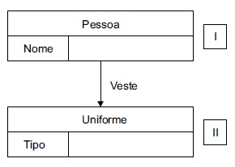

### Revisão questões
---
---
[Banco de Dados](FGV - 2024 - SES-MT) Os servidores MySQL versão 8.3 possuem diversos tipos de arquivos de log.
Os arquivos de log usados nos serviços de replicação de dados são
<ol type="A">
  <li><mark>binary e relay logs</mark></li>
  <li>error e general logs</li>
  <li>replication e DDL logs</li>
  <li>slow query e DML logs</li>
</ol>

O MySQL Server possui vários logs que podem ajudá-lo a descobrir qual atividade está ocorrendo.<br>
- **Error log**: Problemas encontrados ao iniciar, executar ou parar o mysqld
- **General query log**: Conexões de clientes estabelecidas e declarações recebidas de clientes
- **Binary log**: Instruções que alteram dados (também usadas para replicação)
-** Relay log**: Alterações de dados recebidas de um servidor de origem de replicação 
- **Slow query log**: Consultas que levaram mais de long_query_timesegundos para serem executadas
- **DDL log (metadata log)**: Operações de metadados executadas por instruções DDL

A linguagem SQL é uma só, porém ela é dividida em tipos de acordo com a funcionalidade dos comandos. Os tipos da linguagem SQL são:

- **DDL - Data Definition Language** - Linguagem de Definição de Dados.
São os comandos que interagem com os objetos do banco.

São comandos DDL : CREATE, ALTER e DROP
- **DML - Data Manipulation Language** - Linguagem de Manipulação de Dados.
São os comandos que interagem com os dados dentro das tabelas.

São comandos DML : INSERT, DELETE e UPDATE
- **DQL - Data Query Language** - Linguagem de Consulta de dados.
São os comandos de consulta.

São comandos DQL : SELECT (é o comando de consulta)
Aqui cabe um parenteses. Em alguns livros o SELECT fica na DML em outros tem esse grupo próprio.
- **DTL - Data Transaction Language** - Linguagem de Transação de Dados.
São os comandos para controle de transação.

São comandos DTL : BEGIN TRANSACTION, COMMIT E ROLLBACK
- **DCL - Data Control Language** - Linguagem de Controle de Dados.
São os comandos para controlar a parte de segurança do banco de dados.

São comandos DCL : GRANT, REVOKE E DENY.

#### Dica para lembrar

- **DML** = "M" do meio vem de Manipulação.
- **DDL** = "D" do meio vem de Definição.
- **DCL** = "C" do meio vem de Controle.
- **DTL** = "T" do meio vem de Transação.
- **DQL** = "Q" do meio vem de "Qonsulta".

---
---
(FGV - 2024 - SES-MT) Computadores utilizam diversos tipos de dispositivos de memória. Considerando que um sistema de memória semicondutora está sujeito a erros, as falhas nesses sistemas podem ser do tipo
<ol type="A">
  <li>locais e remotas.</li>
  <li>voláteis e não voláteis.</li>
  <li>inteiras e ponto flutuante.</li>
  <li><mark>permanentes e não permanentes.</mark></li>
</ol>

Em sistemas de memória semicondutora, as falhas podem ser categorizadas em permanentes (hard errors) e não permanentes (soft errors).

**Falhas permanentes** são aquelas que resultam de danos físicos ou desgaste que afetam permanentemente o funcionamento da memória. Exemplos incluem danos causados por desgaste ou defeitos de fabricação.

**Falhas não permanentes** são temporárias e podem ser causadas por fatores como interferências eletromagnéticas, radiação cósmica, ou problemas temporários de energia. Essas falhas podem ser corrigidas, por exemplo, através de técnicas como Error Correcting Code (ECC).

(VUNESP - Prudenco - Analista de Sistemas Junior 2022)O ITIL v.3 define a chamada matriz de responsabilidades – RACI, sendo correto afirmar sobre esse acrônimo: 
<ol type="A">
    <li>o C do acrônimo significa Consulted e indica o papel do responsável pelo registro do produto resultante junto aos órgãos responsáveis.</li>
    <li><mark>o I do acrônimo significa Informed e indica o papel do(s) responsável(eis) por tomar conhecimento das decisões ou ações.</mark></li>
    <li>o R do acrônimo significa Responsible e indica o papel do profissional que cuida da contratação da equipe de projeto.</li>
    <li>o A do acrônimo significa Accountable e indica o papel do responsável pela aquisição de todos aplicativos necessários ao projeto.</li>
    <li>o A do acrônimo significa Accountable e indica o papel do profissional que deve comunicar os resultados do projeto ao cliente.</li>
</ol>

A matriz de responsabilidades, frequentemente referida como **Matriz RACI** (Responsibility Assignment Matrix), é uma ferramenta amplamente utilizada no ITIL v3 para clarificar e definir papéis e responsabilidades em processos e atividades de gerenciamento de serviços de TI. RACI é um acrônimo que representa quatro tipos de envolvimento:

1. **Responsável (R - Responsible)**: A pessoa ou grupo que executa a tarefa ou atividade. Eles são responsáveis por concluir o trabalho e, geralmente, são os "fazedores".

2. **Aprovador (A - Accountable)**: A pessoa ou grupo que é o "dono" da tarefa ou atividade. Eles têm a responsabilidade final e autoridade para tomar decisões. Deve haver apenas um "Aprovador" para cada tarefa para evitar confusão.

3. **Consultado (C - Consulted)**: Pessoas ou grupos que são consultados antes de uma decisão ou ação ser tomada. Eles oferecem conselhos, informações e feedback. A comunicação é bidirecional.

4. **Informado (I - Informed)**: Pessoas ou grupos que são mantidos informados sobre o progresso e as decisões. A comunicação é unidirecional, e eles não participam diretamente do processo.

### Exemplo de Matriz RACI no Contexto de ITIL v3

Vamos considerar um exemplo para o processo de **Gerenciamento de Incidentes**:

| Atividade                      | Gerente de TI | Equipe de Suporte | Analista de Incidentes | Usuário Final |
|--------------------------------|---------------|-------------------|------------------------|---------------|
| Identificar e Registrar Incidente | A             | R                 | C                      | I             |
| Classificar e Priorizar Incidente | A             | R                 | C                      | I             |
| Investigação e Diagnóstico     | A             | R                 | C                      | I             |
| Resolução e Recuperação        | A             | R                 | C                      | I             |
| Fechar Incidente               | A             | R                 | C                      | I             |
| Revisão de Incidente           | A             | C                 | R                      | I             |

### Benefícios da Matriz RACI

1. **Clareza de Responsabilidades**: Define claramente quem é responsável por quê, eliminando confusão sobre papéis e responsabilidades.

2. **Melhor Comunicação**: Facilita a comunicação eficaz entre os membros da equipe e outras partes interessadas.

3. **Tomada de Decisões**: Ajuda a identificar quem tem a autoridade para tomar decisões, assegurando que os processos fluam suavemente.

4. **Gestão de Expectativas**: Alinha as expectativas dos envolvidos no processo, garantindo que todos entendam seu papel e responsabilidades.

5. **Acompanhamento e Controle**: Facilita o acompanhamento das atividades e garante que nada seja negligenciado.

### Aplicação da Matriz RACI

Para criar uma matriz RACI, siga estas etapas:

1. **Identifique os processos e atividades**: Liste todas as tarefas ou atividades que precisam ser realizadas.
2. **Identifique os papéis**: Liste todos os papéis ou pessoas envolvidas no processo.
3. **Atribua RACI**: Para cada atividade, atribua uma responsabilidade RACI a cada papel envolvido.
4. **Revisão e Aprovação**: Revise a matriz com todas as partes interessadas para garantir entendimento e concordância.
5. **Implementação e Comunicação**: Comunique a matriz a todos os envolvidos e implemente conforme necessário.

A matriz de responsabilidades é uma ferramenta poderosa para garantir que os processos de gerenciamento de serviços de TI sejam executados de maneira clara, eficiente e sem ambiguidades, alinhando todos os envolvidos aos objetivos do negócio.

---
---
Considerando a gestão da Tecnologia da Informação, uma de suas atribuições é cuidar da gerência de portfólios, sobre a qual é correto afirmar que
Alternativas
A
consiste em um gerenciamento centralizado de um ou mais projetos, visando atingir objetivos estratégicos da empresa.
B
cada recurso físico ou conceitual da empresa deve ser alocado exclusivamente a apenas um projeto, durante toda sua vigência.
C
dispensa a necessidade de haver gerenciamentos individuais de cada projeto participante do portfólio.
D
os gerentes de portfólio devem ser profissionais contratados externamente à empresa.
E
um gerenciamento eficiente de portfólio não admite portfólios com mais de 3 projetos.

(VUNESP - Prudenco - Analista de Sistemas Junior 2022) Considerando a gestão da Tecnologia da Informação, uma de suas atribuições é cuidar da gerência de portfólios, sobre a qual é correto afirmar que
<ol type="A">
    <li><mark>consiste em um gerenciamento centralizado de um ou mais projetos, visando atingir objetivos estratégicos da empresa.</mark></li>
    <li>cada recurso físico ou conceitual da empresa deve ser alocado exclusivamente a apenas um projeto, durante toda sua vigência.</li>
    <li>dispensa a necessidade de haver gerenciamentos individuais de cada projeto participante do portfólio.</li>
    <li>os gerentes de portfólio devem ser profissionais contratados externamente à empresa.</li>
    <li>um gerenciamento eficiente de portfólio não admite portfólios com mais de 3 projetos.</li>
</ol>

Na gestão de TI, **Gerenciamento de Portfólio de Serviços** (ou simplesmente Gerenciamento de Portfólios) é a prática de gerenciar todos os serviços e projetos de TI em uma organização como um portfólio, com o objetivo de garantir que os investimentos em TI estejam alinhados com os objetivos estratégicos da organização. O Gerenciamento de Portfólio é uma parte crítica do ITIL v3 e está incluído na fase de **Estratégia de Serviço**.

### Principais Componentes do Gerenciamento de Portfólios de Serviços

1. **Portfólio de Serviços**:
   - **Serviços em Pipeline**: Serviços que estão sendo desenvolvidos ou planejados.
   - **Catálogo de Serviços**: Serviços que estão atualmente disponíveis e sendo entregues aos clientes.
   - **Serviços Obsoletos**: Serviços que foram retirados de operação, mas que ainda podem ter algumas responsabilidades residuais, como contratos e SLAs (Acordos de Nível de Serviço) existentes.

2. **Gerenciamento de Demandas**:
   - Identifica e gerencia a demanda por serviços de TI, ajudando a alinhar recursos com as necessidades do negócio.

3. **Gerenciamento Financeiro**:
   - Garante que os investimentos em serviços de TI sejam realizados de maneira eficiente e eficaz, proporcionando valor ao negócio.

### Processos no Gerenciamento de Portfólio de Serviços

1. **Identificação de Serviços**:
   - Identificar todos os serviços que estão sendo oferecidos, planejados ou descontinuados.

2. **Classificação e Priorização**:
   - Avaliar e classificar os serviços de acordo com o valor que eles proporcionam ao negócio e sua prioridade estratégica.

3. **Avaliação e Aprovação**:
   - Avaliar os serviços propostos e existentes para garantir que eles estão alinhados com as necessidades e objetivos do negócio, e aprovar ou rejeitar iniciativas.

4. **Alocação de Recursos**:
   - Garantir que recursos (financeiros, humanos, tecnológicos) sejam alocados de maneira eficiente para suportar os serviços e projetos mais importantes.

5. **Monitoramento e Revisão**:
   - Monitorar o desempenho do portfólio de serviços e realizar revisões periódicas para garantir que continua alinhado com as metas estratégicas da organização.

### Benefícios do Gerenciamento de Portfólios de Serviços

1. **Alinhamento Estratégico**:
   - Assegura que todos os serviços e projetos de TI estão alinhados com os objetivos estratégicos e prioridades do negócio.

2. **Otimização de Recursos**:
   - Permite a alocação eficiente de recursos, evitando desperdícios e maximizando o retorno sobre os investimentos em TI.

3. **Visibilidade e Controle**:
   - Proporciona uma visão clara de todos os serviços e projetos de TI, facilitando o controle e a tomada de decisões informadas.

4. **Gestão de Riscos**:
   - Ajuda a identificar e mitigar riscos associados aos serviços de TI e ao portfólio como um todo.

5. **Melhoria Contínua**:
   - Estabelece uma base para a revisão contínua e melhoria dos serviços de TI, assegurando que eles continuem a proporcionar valor ao negócio.

### Exemplo de Gerenciamento de Portfólios de Serviços

Imagine uma organização que oferece vários serviços de TI, como suporte técnico, hospedagem de servidores, desenvolvimento de software e serviços de segurança cibernética. O gerenciamento de portfólio de serviços envolveria:

- **Avaliar cada um desses serviços** para determinar como eles estão contribuindo para os objetivos estratégicos da organização.
- **Priorizar os serviços** e projetos que são mais críticos para o sucesso do negócio.
- **Aprovar novos serviços** ou mudanças em serviços existentes com base em uma análise de custo-benefício.
- **Monitorar continuamente** o desempenho dos serviços para garantir que eles estejam entregando o valor esperado.
- **Descontinuar serviços** que não estão mais alinhados com as necessidades do negócio ou que não estão proporcionando valor.

Em suma, o gerenciamento de portfólios de serviços é essencial para garantir que a TI esteja constantemente alinhada com as metas e prioridades do negócio, proporcionando valor de forma eficiente e eficaz.

---
---
Q2189393-(VUNESP - Prudenco - Analista de Sistemas Junior 2022) O ataque de negação de serviço conhecido como Slowloris é caracterizado
<ol type="A">
    <li>pela inundação de pacotes UDP em diferentes portas no host vítima, fazendo com que sejam procuradas aplicações que respondam a essas portas, as quais não são encontradas. Esse processo causa consumo de recursos, degradando ou impedindo o atendimento a requisições válidas.</li>
    <li>pela inundação de pacotes ICMP Echo Request, os quais são enviados rapidamente para o host vítima, sem esperar pela resposta do pacote anterior, causando consumo indevido de recursos e sobrecarga./li>
    <li>pelo envio sucessivo de requisições SYN para abertura de conexões TCP no host vítima, o qual responde com SYN-ACK. Para completar o three-way handshake, o atacante deveria enviar um ACK, mas não o faz, deixando o host sob ataque esperando. As tentativas inacabadas de conexões TCP causam consumo de recursos, degradando ou impedindo o atendimento a requisições válidas.</li>
    <li>pela inundação de requisições HTTP GET ou POST completas em um servidor web do host vítima, deixando-o sobrecarregado.</li>
    <li><mark>pelo envio sucessivo de requisições HTTP parciais a um servidor web do host vítima, sem intenção de completá-las. O fato de a requisição ficar em aberto, com envios gradativos de cabeçalhos, faz com que o servidor web continue aguardando sua continuidade por um tempo, consumindo recursos que resultam na degradação ou impedimento do atendimento a requisições válidas.</mark></li>
</ol>

O **Slowloris** é um tipo de ataque de negação de serviço (DoS) que visa esgotar os recursos de um servidor web, tornando-o incapaz de atender às solicitações legítimas. O nome "Slowloris" é derivado de uma combinação das palavras "slow" (devagar) e "Loris" (um tipo de primata conhecido por seus movimentos lentos), refletindo a natureza do ataque, que é realizado lentamente para evitar a detecção.

### Como Funciona o Slowloris

1. **Conexões HTTP Incompletas**:
   - Slowloris abre uma conexão HTTP com o servidor alvo, mas em vez de completá-la rapidamente, ele envia cabeçalhos HTTP parciais muito lentamente, mantendo a conexão aberta por longos períodos.

2. **Cabeçalhos Incompletos**:
   - O atacante continua enviando pequenas partes dos cabeçalhos HTTP em intervalos regulares, mas nunca completa a solicitação. Cada nova parte de um cabeçalho é enviada antes do tempo limite do servidor, mantendo a conexão viva.

3. **Esgotamento de Recursos**:
   - Ao manter várias conexões abertas de forma simultânea e incompleta, Slowloris esgota o número de conexões simultâneas que o servidor pode manipular. Isso impede que o servidor responda a novas solicitações legítimas.

4. **Baixo Perfil**:
   - O ataque é realizado de forma lenta e deliberada, consumindo muito pouca largura de banda e dificultando a detecção pelos sistemas de segurança convencionais.

### Efeitos do Slowloris

- **Recursos de Servidor Esgotados**: Como o servidor web mantém essas conexões abertas, ele não pode aceitar novas conexões legítimas, resultando em uma negação de serviço.
- **Impacto em Servidores Vulneráveis**: Servidores que não possuem proteções contra esse tipo de ataque, como limites de conexão por IP ou tempo limite para conexões, são particularmente vulneráveis.

### Medidas de Mitigação

1. **Limitação de Conexões por IP**:
   - Configurar o servidor para limitar o número de conexões simultâneas que um único IP pode abrir.

2. **Timeouts Mais Curtos**:
   - Reduzir o tempo que o servidor espera por um cliente para completar uma solicitação HTTP.

3. **Firewalls e Proxies**:
   - Utilizar firewalls ou proxies que podem detectar e bloquear comportamentos de ataque Slowloris.

4. **Configurações de Servidor**:
   - Ajustar as configurações do servidor web para lidar melhor com conexões lentas, como o uso de módulos ou plugins específicos para mitigar ataques Slowloris.

5. **Servidores Web Modernos**:
   - Usar servidores web modernos ou bem configurados que têm proteção contra esse tipo de ataque. Por exemplo, Nginx e alguns servidores Apache com configurações adequadas são mais resistentes a ataques Slowloris.

### Exemplo de Proteção no Apache

Para mitigar ataques Slowloris no servidor Apache, você pode usar o módulo `mod_reqtimeout` que define limites de tempo para receber cabeçalhos e corpo da requisição. Um exemplo de configuração é:

```apache
<IfModule reqtimeout_module>
  RequestReadTimeout header=20-40,MinRate=500 body=20,MinRate=500
</IfModule>
```

### Exemplo de Proteção no Nginx

Nginx geralmente é menos vulnerável ao Slowloris por padrão, mas ajustes adicionais podem ser feitos:

```nginx
server {
  listen 80;
  server_name example.com;
  
  client_body_timeout 10s;
  client_header_timeout 10s;
  keepalive_timeout 5s 5s;
  send_timeout 10s;
}
```

### Conclusão

Slowloris é um ataque eficaz e sorrateiro que pode causar uma negação de serviço esgotando as conexões de um servidor web. Compreender seu funcionamento e implementar as medidas de mitigação apropriadas é crucial para proteger servidores contra este tipo de ameaça.

Claro! A seguir, forneço exemplos de código para configurar medidas de mitigação contra ataques Slowloris em servidores Apache e Nginx.

### Apache

Para mitigar ataques Slowloris no servidor Apache, você pode usar o módulo `mod_reqtimeout` para definir limites de tempo para receber cabeçalhos e o corpo da requisição. Aqui está um exemplo de configuração:

#### Passo 1: Habilitar o Módulo `mod_reqtimeout`
Primeiro, certifique-se de que o módulo `mod_reqtimeout` esteja habilitado. Você pode habilitar este módulo executando o seguinte comando:

```sh
sudo a2enmod reqtimeout
sudo systemctl restart apache2
```

#### Passo 2: Configurar o Tempo Limite
Edite o arquivo de configuração do Apache (geralmente `apache2.conf` ou o arquivo de configuração específico do seu site dentro da pasta `sites-available`) para adicionar a seguinte configuração:

```apache
<IfModule reqtimeout_module>
  RequestReadTimeout header=20-40,MinRate=500 body=20,MinRate=500
</IfModule>
```

Explicação:
- `header=20-40`: Define o tempo limite para leitura dos cabeçalhos HTTP entre 20 e 40 segundos.
- `MinRate=500`: Define a taxa mínima de leitura em bytes por segundo.
- `body=20`: Define o tempo limite para leitura do corpo da requisição como 20 segundos.

### Nginx

Nginx geralmente é menos vulnerável ao Slowloris por padrão, mas você pode ajustar suas configurações para maior segurança.

#### Passo 1: Editar a Configuração do Nginx
Abra o arquivo de configuração do Nginx, que pode ser `nginx.conf` ou o arquivo de configuração específico do seu site dentro da pasta `sites-available`.

Adicione ou ajuste as seguintes diretivas dentro do bloco `server`:

```nginx
server {
    listen 80;
    server_name example.com;

    # Definir o tempo limite para leitura do corpo do cliente
    client_body_timeout 10s;
    
    # Definir o tempo limite para leitura do cabeçalho do cliente
    client_header_timeout 10s;
    
    # Definir o tempo limite de keep-alive para a conexão do cliente
    keepalive_timeout 5s 5s;
    
    # Definir o tempo limite para enviar a resposta ao cliente
    send_timeout 10s;

    # Outras configurações do servidor
    location / {
        # Configurações do local
    }
}
```

Explicação:
- `client_body_timeout 10s;`: Define o tempo limite para leitura do corpo da requisição do cliente como 10 segundos.
- `client_header_timeout 10s;`: Define o tempo limite para leitura dos cabeçalhos do cliente como 10 segundos.
- `keepalive_timeout 5s 5s;`: Define o tempo limite para conexões keep-alive como 5 segundos.
- `send_timeout 10s;`: Define o tempo limite para enviar a resposta ao cliente como 10 segundos.

#### Passo 2: Reiniciar o Nginx
Depois de fazer essas mudanças, reinicie o Nginx para aplicar as novas configurações:

```sh
sudo systemctl restart nginx
```

### Outras Medidas Adicionais

Além das configurações específicas para Apache e Nginx, você pode implementar outras medidas de segurança, como utilizar firewalls e proxies, para ajudar a mitigar ataques Slowloris:

#### Usar um Firewall

Você pode usar `iptables` para limitar o número de conexões simultâneas de um único IP:

```sh
sudo iptables -A INPUT -p tcp --syn --dport 80 -m connlimit --connlimit-above 10 -j DROP
```

Este comando limita a 10 o número de conexões simultâneas de um único IP para a porta 80 (HTTP).

#### Usar um Proxy Reverso

Utilizar um proxy reverso como Cloudflare, AWS CloudFront ou Nginx em frente ao seu servidor web pode ajudar a mitigar ataques de negação de serviço, incluindo o Slowloris.

### Conclusão

Mitigar ataques Slowloris envolve configurar corretamente o servidor web para limitar o impacto de conexões lentas e incompletas. As configurações de tempo limite no Apache e Nginx são uma parte crucial dessa estratégia. Além disso, o uso de firewalls e proxies reversos pode oferecer camadas adicionais de proteção.

Sim, existem muitos tipos diferentes de ataques de negação de serviço (DoS), além do Slowloris. Cada tipo de ataque visa esgotar recursos do sistema, rede ou aplicação para impedir que usuários legítimos acessem serviços. Aqui estão alguns exemplos comuns:

### 1. **Ataque de Volume**

#### **UDP Flood**

- **Descrição**: Envia uma grande quantidade de pacotes UDP (User Datagram Protocol) para um ou mais alvos. Como o UDP é um protocolo sem conexão, o servidor alvo tenta processar esses pacotes, resultando em esgotamento de recursos.
- **Exemplo**: Um atacante envia pacotes UDP aleatórios para portas diferentes de um servidor. O servidor tenta processar cada pacote e, se a carga for suficientemente alta, os recursos do servidor se esgotam, causando uma negação de serviço.

#### **ICMP Flood (Ping Flood)**

- **Descrição**: Envia uma grande quantidade de pacotes ICMP (Internet Control Message Protocol), como solicitações de echo (ping), para o alvo. O servidor ou rede alvo tenta responder a cada solicitação, consumindo recursos.
- **Exemplo**: Um atacante envia milhares de pings por segundo a um servidor, sobrecarregando a rede e o próprio servidor, resultando em uma negação de serviço.

### 2. **Ataque de Protocolo**

#### **SYN Flood**

- **Descrição**: Envia uma série de pacotes SYN (sincronização) ao alvo, mas não responde à resposta SYN-ACK do servidor. Isso deixa muitas conexões meio abertas, esgotando a tabela de conexões do servidor.
- **Exemplo**: Um atacante envia pacotes SYN com um endereço IP falsificado, iniciando muitas conexões com um servidor. O servidor responde com pacotes SYN-ACK, mas nunca recebe a confirmação (ACK) de volta, deixando a conexão aberta e consumindo recursos.

#### **Ping of Death**

- **Descrição**: Envia pacotes ICMP fragmentados que, quando reassemblados, excedem o tamanho máximo permitido para pacotes IP. Isso pode causar travamento ou comportamento inesperado no sistema alvo.
- **Exemplo**: Um atacante envia pacotes ICMP fragmentados a um servidor. Quando o servidor tenta remontar os pacotes, o tamanho excede o limite permitido, causando uma falha no sistema.

### 3. **Ataques de Camada de Aplicação**

#### **HTTP Flood**

- **Descrição**: Envia um grande número de solicitações HTTP ao servidor web, simulando um grande número de usuários legítimos. Isso pode esgotar os recursos do servidor web.
- **Exemplo**: Um atacante usa um botnet para enviar milhares de solicitações HTTP a uma página específica de um site, sobrecarregando o servidor web e tornando-o incapaz de responder a solicitações legítimas.

#### **Slow POST/Slow GET**

- **Descrição**: Envia dados POST ou GET ao servidor web de forma muito lenta, mantendo a conexão aberta e esgotando recursos. Similar ao Slowloris, mas usando métodos POST ou GET.
- **Exemplo**: Um atacante envia uma requisição POST com um corpo de dados muito grande, mas envia os dados de forma extremamente lenta. O servidor mantém a conexão aberta esperando os dados, resultando em esgotamento de recursos.

### 4. **Ataques Distribuídos de Negação de Serviço (DDoS)**

- **Descrição**: Utiliza um grande número de máquinas comprometidas (botnet) para realizar um ataque coordenado contra um ou mais alvos, tornando a defesa mais difícil.
- **Exemplo**: Um atacante controla uma rede de milhares de dispositivos comprometidos e os instrui a enviar tráfego massivo a um servidor específico. A grande quantidade de tráfego de diversas fontes torna difícil para o servidor distinguir entre tráfego legítimo e malicioso, resultando em negação de serviço.

### 5. **Ataques Amplificação e Reflected DDoS**

#### **DNS Amplification**

- **Descrição**: Envia uma pequena consulta DNS com o endereço IP do alvo falsificado para um servidor DNS aberto. O servidor DNS responde com uma resposta muito maior, inundando o alvo com tráfego.
- **Exemplo**: Um atacante envia consultas DNS para muitos servidores DNS públicos, mas falsifica o endereço IP de origem para que pareça ser o do alvo. O alvo recebe uma grande quantidade de respostas DNS volumosas, causando uma sobrecarga.

#### **NTP Amplification**

- **Descrição**: Explora servidores NTP (Network Time Protocol) abertos para amplificar o tráfego de ataque. Envia uma pequena requisição NTP com o endereço IP do alvo falsificado.
- **Exemplo**: Um atacante envia consultas NTP para servidores NTP abertos, falsificando o endereço IP de origem para que pareça ser o do alvo. O alvo recebe respostas amplificadas, resultando em um tráfego muito maior do que o original enviado pelo atacante.

### Medidas de Mitigação

1. **Firewalls e Sistemas de Prevenção de Intrusão (IPS)**: Configurar para detectar e bloquear padrões de tráfego de ataque.
2. **Rate Limiting**: Limitar a taxa de requisições por IP.
3. **Filtros de Protocolo**: Bloquear pacotes de protocolos maliciosos.
4. **CDNs e Serviços de Proteção DDoS**: Utilizar redes de distribuição de conteúdo (CDNs) e serviços especializados em mitigação de DDoS.
5. **Ajuste de Configurações do Servidor**: Configurar tempos limites e limites de conexões adequadamente.

Entender os diferentes tipos de ataques de negação de serviço e implementar medidas de mitigação adequadas é crucial para proteger sistemas e redes contra interrupções.

---
---
(VUNESP - 2022 - PRUDENCO - Analista de Sistemas Junior) Deseja-se monitorar o conteúdo do tráfego que passa por uma interface de rede em um computador com sistema operacional Windows. Dentre as alternativas a seguir, aquela que apresenta o programa adequado para essa finalidade é:
<ol type="A">
    <li>ipconfig.</li>
    <li>ping.</li>
    <li>Nmap.</li>
    <li><mark>Wireshark.</mark></li>
    <li>netstat.</li>
</ol>

O programa adequado para monitorar o conteúdo do tráfego que passa por uma interface de rede em um computador com sistema operacional Windows é o Wireshark. Ele é um analisador de protocolos de rede que permite capturar e examinar os pacotes de dados que estão sendo transmitidos em uma rede.

As outras alternativas são falsas porque:

- Alternativa A: O comando `ipconfig` é usado para exibir informações sobre as configurações de rede do computador, não para monitorar o tráfego de rede.

- Alternativa B: O comando `ping` é usado para testar a conectividade entre dois dispositivos na rede, não para monitorar o tráfego de rede.

- Alternativa C: O Nmap é uma ferramenta usada para mapeamento de rede e auditoria de segurança, não para monitorar o tráfego de rede.

- Alternativa E: O comando `netstat` é usado para exibir informações sobre conexões de rede ativas e estatísticas de rede, não para monitorar o tráfego de rede.

(VUNESP - 2022 - PRUDENCO - Analista de Sistemas Junior) O protocolo SNMP suporta a possibilidade de executar operações sobre dispositivos gerenciados na rede. Nesse contexto, a abordagem usada pelo protocolo é
Alternativas

<ol type="A">
    <li>prover vários comandos que cobrem uma gama muito grande de possibilidades, tais como reiniciar, habilitar, desabilitar etc., prevendo muitas operações que possam ser realizadas por dispositivos de vários tipos.</li>
    <li>usar o HTTP como protocolo subjacente, baseando-se em requisições GET e POST. Os dispositivos gerenciados apresentam servidores web, e o caminho informado na requisição determina a operação a ser realizada.</li>
    <li><mark>prover poucas operações, principalmente de leitura e escrita de variáveis, que permitem consultar e alterar valores associados a itens de dados. As operações sobre um dispositivo gerenciado consistem em efeitos resultantes das operações de leitura e escrita.</mark></li>
    <li>requerer um gateway intermediário entre agente e gerente, o qual traduz requisições padronizadas dos gerentes para protocolos específicos dos agentes, possibilitando a realização de operações específicas em cada um. </li>
    <li>usar o FTP como protocolo subjacente, possibilitando o upload e download de arquivos padronizados entre agentes e gerentes. Esses arquivos contêm requisições para execução de operações e respostas.</li>
</ol>

### Protocolo SNMP (Simple Network Management Protocol)

O Simple Network Management Protocol (SNMP) é um protocolo padrão da Internet usado para monitorar e gerenciar dispositivos em redes IP. Dispositivos que normalmente suportam SNMP incluem roteadores, switches, servidores, estações de trabalho, impressoras e mais. O SNMP permite que administradores de rede gerenciem o desempenho da rede, encontrem e resolvam problemas de rede e planejem seu crescimento.

### Componentes do SNMP

1. **Gerente (Manager)**: Um sistema de gerenciamento que solicita informações e envia comandos aos agentes SNMP.
2. **Agente (Agent)**: Um software em dispositivos de rede que responde a pedidos SNMP e envia traps ao gerente.
3. **MIB (Management Information Base)**: Um banco de dados virtual de informações de gerenciamento de rede, contendo uma coleção hierárquica de objetos.

### Versões do SNMP

- **SNMPv1**: A versão original, definida em 1988.
- **SNMPv2**: Introduziu melhorias, incluindo segurança, mas ainda é considerado inseguro.
- **SNMPv3**: Introduziu segurança criptográfica, como autenticação e privacidade.

### Estrutura do SNMP

- **OID (Object Identifier)**: Um identificador que especifica um parâmetro na MIB.
- **Comunidades**: Strings que atuam como senhas para autenticação (apenas no SNMPv1 e v2).

### Exemplos de Operações SNMP

1. **GET**: Solicita o valor de um objeto da MIB.
2. **SET**: Define o valor de um objeto da MIB.
3. **GETNEXT**: Solicita o próximo objeto na MIB.
4. **GETBULK**: Solicita um grande conjunto de dados.
5. **TRAP**: Envia uma mensagem não solicitada do agente para o gerente.
6. **INFORM**: Semelhante a TRAP, mas inclui reconhecimento do gerente.

### Exemplos de Código SNMP

#### Utilizando Python e a Biblioteca `pysnmp`

##### Instalação

Primeiro, instale a biblioteca `pysnmp`:

```sh
pip install pysnmp
```

##### Exemplo de GET Request

```python
from pysnmp.hlapi import *

def snmp_get(oid, ip, community='public'):
    errorIndication, errorStatus, errorIndex, varBinds = next(
        getCmd(SnmpEngine(),
               CommunityData(community),
               UdpTransportTarget((ip, 161)),
               ContextData(),
               ObjectType(ObjectIdentity(oid)))
    )
    
    if errorIndication:
        print(errorIndication)
    elif errorStatus:
        print(f'{errorStatus.prettyPrint()} at {errorIndex and varBinds[int(errorIndex) - 1][0] or "?"}')
    else:
        for varBind in varBinds:
            print(' = '.join([x.prettyPrint() for x in varBind]))

# Exemplo de uso
snmp_get('1.3.6.1.2.1.1.1.0', '192.168.1.1')
```

Este código realiza uma solicitação SNMP GET para o objeto `sysDescr` em um dispositivo com IP `192.168.1.1`.

##### Exemplo de SET Request

```python
from pysnmp.hlapi import *

def snmp_set(oid, value, ip, community='private'):
    errorIndication, errorStatus, errorIndex, varBinds = next(
        setCmd(SnmpEngine(),
               CommunityData(community),
               UdpTransportTarget((ip, 161)),
               ContextData(),
               ObjectType(ObjectIdentity(oid), value))
    )

    if errorIndication:
        print(errorIndication)
    elif errorStatus:
        print(f'{errorStatus.prettyPrint()} at {errorIndex and varBinds[int(errorIndex) - 1][0] or "?"}')
    else:
        for varBind in varBinds:
            print(' = '.join([x.prettyPrint() for x in varBind]))

# Exemplo de uso (modifique para um OID que suporte SET)
# snmp_set('1.3.6.1.2.1.1.4.0', OctetString('new_contact'), '192.168.1.1')
```

Este código realiza uma solicitação SNMP SET para definir o valor de um objeto da MIB.

#### Utilizando Net-SNMP em Linux

Você também pode usar o pacote Net-SNMP para realizar operações SNMP a partir da linha de comando.

##### Instalação

```sh
sudo apt-get install snmp
```

##### Exemplo de GET Request

```sh
snmpget -v 2c -c public 192.168.1.1 1.3.6.1.2.1.1.1.0
```

##### Exemplo de SET Request

```sh
snmpset -v 2c -c private 192.168.1.1 1.3.6.1.2.1.1.4.0 s "new_contact"
```

### Conclusão

O SNMP é uma ferramenta poderosa para gerenciar e monitorar redes. Ele permite que administradores de rede obtenham informações detalhadas sobre o estado dos dispositivos de rede e realizem alterações na configuração remotamente. Com as bibliotecas e ferramentas corretas, como `pysnmp` para Python e Net-SNMP para linha de comando, você pode integrar facilmente operações SNMP em seus scripts e processos de gerenciamento de rede.

SNMP é um protocolo relativamente simples e robusto, porém suficientemente poderoso para resolver os difíceis problemas apresentados quando se deseja gerenciar redes heterogêneas.

Simples porque os recursos gerenciados necessitam de pouco processamento nas tarefas de gerenciamento e requerem “pouco” software. Tarefas mais complexas de processamento e armazenamento de dados são de responsabilidade do sistema gerenciador. Poucas funções de gerenciamento são pertinentes aos recursos gerenciados.

O SNMP é um protocolo não orientado a conexão: não requer ação prévia nem posterior ao envio de mensagens, fazendo com que não haja nenhuma garantia de que as mensagens do protocolo chegarão ao destino. Robusto porque, como não existe conexão, nem o gerente nem o sistema gerenciado necessitam um do outro para operar.

---
---
O cabeçalho do protocolo IPv4 possui o campo DS (Differentiated Services) de 8 bits, o qual substituiu o antigo ToS (Type of Service). O DS é subdividido em DSCP (Differentiated Services Code Point) de 6 bits e ECN (Explicit Congestion Notification) de 2 bits. Uma das classes de tráfego codificadas pelo DSCP é conhecida como Expedited Forwarding. As características dessa classe são relacionadas a aplicações de
<ol type="A">
    <li><mark>transmissão de voz, vídeo e serviços de tempo real.</mark></li>
    <li>acesso a websites convencionais, tais como sistemas corporativos e e-commerces. </li>
    <li>transferência de arquivos que podem aguardar para serem concluídas, tais como FTP ou SFTP.</li>
    <li>envio e recepção de e-mails.</li>
    <li>resolução de nomes DNS.</li>
</ol>

### Cabeçalho IPv4

O cabeçalho IPv4 é a parte do pacote IP que contém informações de controle e roteamento. O cabeçalho IPv4 tem um tamanho mínimo de 20 bytes, podendo ser maior se houver opções adicionais.

### Estrutura do Cabeçalho IPv4

Aqui está uma descrição detalhada dos campos do cabeçalho IPv4:

1. **Versão (Version)**: 4 bits
   - Indica a versão do protocolo IP. Para IPv4, este campo é 4.
   - **Exemplo**: `4`

2. **Comprimento do Cabeçalho (IHL - Internet Header Length)**: 4 bits
   - Indica o tamanho do cabeçalho em palavras de 32 bits. O valor mínimo é 5 (20 bytes).
   - **Exemplo**: `5` (corresponde a 20 bytes)

3. **Tipo de Serviço (DSCP/ECN)**: 8 bits
   - DSCP (Differentiated Services Code Point): 6 bits, utilizado para classificar o tráfego.
   - ECN (Explicit Congestion Notification): 2 bits, utilizado para indicar a presença de congestionamento na rede.
   - **Exemplo**: `0x00` (sem preferência de tráfego, sem notificação de congestionamento)

4. **Comprimento Total (Total Length)**: 16 bits
   - Especifica o tamanho total do pacote IP, incluindo cabeçalho e dados, em bytes. O valor mínimo é 20 bytes.
   - **Exemplo**: `0x0040` (64 bytes)

5. **Identificação (Identification)**: 16 bits
   - Utilizado para identificar fragmentos de um pacote IP.
   - **Exemplo**: `0x1c46`

6. **Flags**: 3 bits
   - Indica se o pacote pode ser fragmentado e se é o último fragmento.
   - **Bit 0**: Reservado, deve ser 0.
   - **Bit 1**: DF (Don't Fragment) - 1 se o pacote não pode ser fragmentado.
   - **Bit 2**: MF (More Fragments) - 1 se há mais fragmentos após este.
   - **Exemplo**: `0x2` (DF = 1, não fragmentar)

7. **Deslocamento de Fragmento (Fragment Offset)**: 13 bits
   - Indica a posição do fragmento em relação ao início do pacote original, em unidades de 8 bytes.
   - **Exemplo**: `0x0000` (não fragmentado)

8. **Tempo de Vida (TTL - Time to Live)**: 8 bits
   - Especifica o número máximo de saltos que o pacote pode fazer antes de ser descartado.
   - **Exemplo**: `64`

9. **Protocolo (Protocol)**: 8 bits
   - Indica o protocolo da camada superior encapsulado no pacote IP.
   - **Exemplo**: `0x06` (TCP)

10. **Checksum do Cabeçalho (Header Checksum)**: 16 bits
    - Campo de verificação de erros para o cabeçalho IP.
    - **Exemplo**: `0xb861`

11. **Endereço IP de Origem (Source Address)**: 32 bits
    - Endereço IP do remetente do pacote.
    - **Exemplo**: `192.168.0.1` (em notação decimal: `0xc0a80001`)

12. **Endereço IP de Destino (Destination Address)**: 32 bits
    - Endereço IP do destinatário do pacote.
    - **Exemplo**: `192.168.0.2` (em notação decimal: `0xc0a80002`)

13. **Opções e Preenchimento (Options and Padding)**: Variável
    - Utilizado para recursos opcionais, como segurança, roteamento, etc. Deve ser múltiplo de 32 bits.
    - **Exemplo**: Se não houver opções, o campo é omitido.

### Exemplo de Cabeçalho IPv4 em Hexadecimal

Para ilustrar, aqui está um exemplo de um cabeçalho IPv4 com valores fictícios:

```
45 00 00 40 1c 46 40 00 40 06 b8 61 c0 a8 00 01 c0 a8 00 02
```

- **45**: Versão 4 e IHL 5 (0100 0101)
- **00**: Tipo de Serviço (DSCP/ECN)
- **00 40**: Comprimento Total (64 bytes)
- **1c 46**: Identificação
- **40 00**: Flags (DF set) e Fragment Offset (0)
- **40**: TTL (64)
- **06**: Protocolo (TCP)
- **b8 61**: Checksum do Cabeçalho
- **c0 a8 00 01**: Endereço IP de Origem (192.168.0.1)
- **c0 a8 00 02**: Endereço IP de Destino (192.168.0.2)

### Notas Importantes

1. **Checksum do Cabeçalho**: Calculado apenas para o cabeçalho, não para os dados. É usado para verificar a integridade do cabeçalho.
2. **Fragmentação**: Pacotes grandes podem ser fragmentados em unidades menores para transmissão. Cada fragmento possui o mesmo valor de identificação, mas diferentes deslocamentos.
3. **TTL**: O campo TTL é decrementado por cada roteador pelo qual o pacote passa. Quando TTL chega a zero, o pacote é descartado. Isso evita loops infinitos.
4. **Protocolo**: Indica o tipo de dados que o pacote carrega (TCP, UDP, ICMP, etc.).

### Conclusão

O cabeçalho IPv4 é crucial para o roteamento e entrega de pacotes na rede. Compreender cada campo do cabeçalho e seu propósito ajuda na administração, monitoramento e solução de problemas em redes IP.

### Cabeçalho IPv6

O cabeçalho IPv6 é mais simples e eficiente que o cabeçalho IPv4, projetado para facilitar o roteamento e a gestão de pacotes na Internet moderna. Ele tem um tamanho fixo de 40 bytes, ao contrário do cabeçalho IPv4, que tem tamanho variável.

### Estrutura do Cabeçalho IPv6

Aqui está uma descrição detalhada dos campos do cabeçalho IPv6:

1. **Versão (Version)**: 4 bits
   - Indica a versão do protocolo IP. Para IPv6, este campo é 6.
   - **Exemplo**: `6`

2. **Classe de Tráfego (Traffic Class)**: 8 bits
   - Utilizado para diferenciar tipos de tráfego e priorizar pacotes (semelhante ao campo DSCP no IPv4).
   - **Exemplo**: `0x00` (sem prioridade específica)

3. **Rótulo de Fluxo (Flow Label)**: 20 bits
   - Identifica fluxos de pacotes que requerem tratamento especial pela camada de rede, como QoS.
   - **Exemplo**: `0x00000` (sem fluxo específico)

4. **Comprimento do Payload (Payload Length)**: 16 bits
   - Indica o tamanho dos dados transportados pelo pacote, excluindo o cabeçalho.
   - **Exemplo**: `0x003c` (60 bytes)

5. **Próximo Cabeçalho (Next Header)**: 8 bits
   - Indica o tipo de cabeçalho seguinte ou protocolo da camada superior (ex: TCP, UDP, ICMPv6).
   - **Exemplo**: `0x3a` (ICMPv6)

6. **Limite de Saltos (Hop Limit)**: 8 bits
   - Semelhante ao TTL no IPv4, decremente a cada roteador até o pacote ser descartado quando chegar a zero.
   - **Exemplo**: `0x40` (64 saltos)

7. **Endereço de Origem (Source Address)**: 128 bits
   - Endereço IPv6 do remetente do pacote.
   - **Exemplo**: `2001:0db8:85a3:0000:0000:8a2e:0370:7334`

8. **Endereço de Destino (Destination Address)**: 128 bits
   - Endereço IPv6 do destinatário do pacote.
   - **Exemplo**: `2001:0db8:85a3:0000:0000:8a2e:0370:7335`

### Exemplo de Cabeçalho IPv6 em Hexadecimal

Para ilustrar, aqui está um exemplo de um cabeçalho IPv6 com valores fictícios:

```
60 00 00 00 00 3c 3a 40 20 01 0d b8 85 a3 00 00 00 00 8a 2e 03 70 73 34 20 01 0d b8 85 a3 00 00 00 00 8a 2e 03 70 73 35
```

- **60**: Versão 6 e Traffic Class (0110 0000)
- **00 00 00**: Flow Label (0000 0000 0000 0000 0000)
- **00 3c**: Payload Length (60 bytes)
- **3a**: Next Header (ICMPv6)
- **40**: Hop Limit (64 saltos)
- **20 01 0d b8 85 a3 00 00 00 00 8a 2e 03 70 73 34**: Endereço de Origem (`2001:0db8:85a3:0000:0000:8a2e:0370:7334`)
- **20 01 0d b8 85 a3 00 00 00 00 8a 2e 03 70 73 35**: Endereço de Destino (`2001:0db8:85a3:0000:0000:8a2e:0370:7335`)

### Notas Importantes

1. **Cabeçalho Fixo**: O cabeçalho IPv6 tem um tamanho fixo de 40 bytes, simplificando o processamento em roteadores.
2. **Sem Fragmentação no Cabeçalho Principal**: A fragmentação é tratada por cabeçalhos de extensão, não no cabeçalho principal.
3. **Eficiência e Simplicidade**: O cabeçalho IPv6 removeu ou simplificou vários campos do IPv4 para aumentar a eficiência.
4. **Next Header**: Utilizado para encadear cabeçalhos de extensão ou indicar o protocolo da camada superior. Este campo é crucial para a extensibilidade do IPv6.
5. **Rótulo de Fluxo (Flow Label)**: Permite a identificação de fluxos de tráfego específicos que precisam de tratamento especial, como QoS, facilitando a gestão de tráfego em redes modernas.

### Conclusão

O cabeçalho IPv6 foi projetado para ser mais simples e eficiente que o cabeçalho IPv4, removendo campos desnecessários e otimizando o processamento de pacotes. Com um tamanho fixo de 40 bytes, ele facilita o roteamento e a gestão de pacotes na Internet moderna, proporcionando melhor suporte para QoS e extensibilidade através de cabeçalhos de extensão.

No IPv4 e no IPv6, a classe de tráfego é gerenciada pelo campo "Tipo de Serviço" (Type of Service, ToS) ou "Traffic Class". Esse campo foi modernizado para suportar o Differentiated Services Code Point (DSCP), que define várias classes de tráfego para diferenciar e priorizar o tratamento de pacotes na rede.

### Classes de Tráfego DSCP

O DSCP utiliza 6 bits do campo de "Tipo de Serviço", permitindo até 64 valores diferentes. No entanto, alguns desses valores são padronizados em classes de tráfego específicas. As principais classes de tráfego são:

1. **Expedited Forwarding (EF)**:
   - **Código DSCP**: `101110` (46 decimal)
   - **Descrição**: Projetado para serviços de alta prioridade, como VoIP e streaming de vídeo, que requerem baixa latência, baixa perda de pacotes e pouca variação no atraso.
   - **Exemplo**: Chamadas de VoIP, streaming de vídeo em tempo real.

2. **Assured Forwarding (AF)**:
   - **Código DSCP**: Variável, com quatro classes de prioridade e três níveis de descarte dentro de cada classe.
     - AF1x: `0010xx`
     - AF2x: `0100xx`
     - AF3x: `0110xx`
     - AF4x: `1000xx`
   - **Descrição**: Oferece diferentes níveis de garantia de entrega. Cada classe tem três subníveis, indicados como `AFxy`, onde `x` é a classe e `y` é o nível de descarte.
   - **Exemplo**: AF31 (`011010` - 26 decimal): tráfego corporativo importante, mas não crítico.

3. **Default Forwarding (DF)**:
   - **Código DSCP**: `000000` (0 decimal)
   - **Descrição**: Tratamento padrão de "best-effort" para tráfego que não requer qualquer tipo de QoS especial.
   - **Exemplo**: Tráfego de e-mails, navegação web padrão.

4. **Class Selector (CS)**:
   - **Código DSCP**: `xxx000`
   - **Descrição**: Compatível com o campo ToS original, utilizado para manter a compatibilidade com QoS antigo. Há 8 classes (CS0 a CS7), onde CS0 é o tráfego padrão.
   - **Exemplo**:
     - CS1 (`001000` - 8 decimal): tráfego de baixo custo.
     - CS3 (`011000` - 24 decimal): tráfego crítico de rede.

5. **Voice-Admit**:
   - **Código DSCP**: `101100` (44 decimal)
   - **Descrição**: Utilizado para admitir chamadas de voz através de uma rede com recursos gerenciados.
   - **Exemplo**: Chamadas VoIP com admissão controlada.

6. **Best-Effort**:
   - **Código DSCP**: `000000` (0 decimal)
   - **Descrição**: Tráfego padrão que não tem requisitos especiais de QoS.
   - **Exemplo**: Navegação web, downloads de arquivos.

### Exemplos de Uso de DSCP

#### VoIP (Expedited Forwarding)

Para uma chamada VoIP que requer baixa latência e alta prioridade:

- **Código DSCP**: `101110` (46)
- **Classe**: EF (Expedited Forwarding)
- **Descrição**: Assegura que o tráfego de voz tenha prioridade alta, com pouca latência e perda de pacotes.

#### Tráfego Corporativo Importante (Assured Forwarding)

Para uma aplicação corporativa importante, mas não crítica:

- **Código DSCP**: `011010` (26)
- **Classe**: AF31 (Assured Forwarding, classe 3, baixo nível de descarte)
- **Descrição**: Garantia de entrega razoável com prioridade moderada.

#### Tráfego de Navegação Web (Best-Effort)

Para navegação web padrão sem requisitos de QoS:

- **Código DSCP**: `000000` (0)
- **Classe**: DF (Default Forwarding)
- **Descrição**: Tratamento padrão "best-effort".

### Implementação de DSCP

No Linux, por exemplo, é possível definir DSCP para pacotes de saída utilizando `iptables`:

```sh
# Marcar pacotes de VoIP com EF (46)
iptables -t mangle -A OUTPUT -p udp --dport 5060 -j DSCP --set-dscp 46

# Marcar pacotes de aplicação corporativa importante com AF31 (26)
iptables -t mangle -A OUTPUT -p tcp --dport 12345 -j DSCP --set-dscp 26

# Marcar pacotes de navegação web com Best-Effort (0)
iptables -t mangle -A OUTPUT -p tcp --dport 80 -j DSCP --set-dscp 0
```

### Conclusão

O uso de DSCP permite que as redes diferenciem e priorizem diferentes tipos de tráfego, garantindo que aplicações críticas como VoIP e vídeo em tempo real recebam o tratamento adequado. Isso é crucial para manter a qualidade de serviço (QoS) e assegurar que os recursos de rede sejam utilizados de maneira eficiente e justa.

---
---
Em redes de comutação de pacotes, uma métrica de QoS (Quality of Service) é conhecida como jitter. Considerando um cenário no qual um fluxo de pacotes é transmitido de uma origem a um destino com intervalo de tempo bem definido entre pacotes, essa métrica representa 
<ol type="A">
    <li>o atraso fim-a-fim médio.</li>
    <li><mark>a variação do atraso fim-a-fim.</mark></li>
    <li>a taxa de perda de pacotes.</li>
    <li>a taxa de transmissão de dados da aplicação, medida em bits por segundo.</li>
    <li>a taxa de transmissão de dados totais, incluindo os dados de cabeçalhos dos protocolos de transporte e camadas inferiores.</li>
</ol>

### Quality of Service (QoS)

**Quality of Service (QoS)** refere-se às tecnologias e técnicas utilizadas para gerenciar e priorizar o tráfego de rede de forma a garantir um desempenho consistente e previsível para diferentes tipos de serviços e aplicações. O objetivo principal do QoS é garantir que aplicações críticas e sensíveis a atrasos, como VoIP, videoconferência e jogos online, tenham a largura de banda necessária e um desempenho estável.

### Principais Conceitos de QoS

1. **Prioritização de Tráfego**: Diferentes tipos de tráfego recebem diferentes níveis de prioridade com base em suas necessidades de performance.
2. **Gerenciamento de Banda**: Controle de como a largura de banda é alocada para diferentes tipos de tráfego para evitar congestionamento.
3. **Modelos de QoS**:
   - **Best-Effort**: Todos os pacotes são tratados da mesma forma, sem qualquer priorização.
   - **Integrated Services (IntServ)**: Utiliza RSVP (Resource Reservation Protocol) para reservar recursos ao longo do caminho dos dados.
   - **Differentiated Services (DiffServ)**: Usa o campo DSCP nos cabeçalhos IP para marcar pacotes, permitindo que roteadores priorizem pacotes com base nessas marcas.

### Componentes de QoS

1. **Classificação e Marcação de Pacotes**: Identificação e rotulação de pacotes com base em regras definidas (por exemplo, usando DSCP).
2. **Filas de Espera (Queuing)**: Organização dos pacotes em filas diferentes com base na prioridade.
3. **Controle de Congestionamento**: Técnicas para gerenciar e minimizar o congestionamento, como o controle de admissão e o descarte de pacotes.
4. **Modelagem e Policiamento de Tráfego**: Controle do fluxo de tráfego para garantir que ele esteja dentro dos limites definidos, ajustando ou descartando pacotes conforme necessário.
5. **Controle de Largura de Banda**: Alocação de largura de banda para diferentes tipos de tráfego de acordo com suas necessidades de performance.

### Tecnologias e Protocolos de QoS

1. **Differentiated Services (DiffServ)**: Usa o campo DSCP (Differentiated Services Code Point) nos cabeçalhos IP para classificar e priorizar pacotes.
2. **Integrated Services (IntServ)**: Utiliza RSVP (Resource Reservation Protocol) para reservar recursos específicos ao longo do caminho de rede para garantir a largura de banda necessária.
3. **Class-Based Queuing (CBQ)**: Cria filas baseadas em classes de tráfego e aplica políticas de QoS a essas classes.
4. **Weighted Fair Queuing (WFQ)**: Aloca largura de banda de forma justa entre as filas de tráfego com diferentes pesos atribuídos a cada fila.
5. **Priority Queuing (PQ)**: Dá prioridade absoluta a certas filas de tráfego, garantindo que pacotes dessas filas sejam processados antes de qualquer outro tráfego.

### Exemplo de Implementação de QoS

#### Usando `iptables` e `tc` no Linux

**Classificação e Marcação de Pacotes com `iptables`**:

```sh
# Marcar pacotes SIP com DSCP EF (46)
iptables -t mangle -A OUTPUT -p udp --dport 5060 -j DSCP --set-dscp 46

# Marcar pacotes RTP (usado para áudio) com DSCP EF (46)
iptables -t mangle -A OUTPUT -p udp --dport 10000:20000 -j DSCP --set-dscp 46
```

**Controle de Tráfego com `tc` (Traffic Control)**:

```sh
# Configurar a interface de rede
tc qdisc add dev eth0 root handle 1: htb default 12

# Criar classes para diferentes tipos de tráfego
tc class add dev eth0 parent 1: classid 1:1 htb rate 100mbit
tc class add dev eth0 parent 1:1 classid 1:10 htb rate 70mbit
tc class add dev eth0 parent 1:1 classid 1:20 htb rate 30mbit

# Criar filas de priorização
tc qdisc add dev eth0 parent 1:10 handle 10: pfifo
tc qdisc add dev eth0 parent 1:20 handle 20: pfifo

# Adicionar filtros para classificar o tráfego
tc filter add dev eth0 protocol ip parent 1:0 prio 1 u32 match ip dscp 46 0xfc flowid 1:10
tc filter add dev eth0 protocol ip parent 1:0 prio 2 u32 match ip dscp 0 0xfc flowid 1:20
```

### Benefícios do QoS

1. **Redução de Latência e Jitter**: Garantia de baixa latência e variação mínima no tempo de entrega dos pacotes para aplicações em tempo real.
2. **Prioridade para Aplicações Críticas**: Garantia de que aplicações críticas tenham os recursos necessários para funcionar de forma eficaz.
3. **Melhor Utilização da Largura de Banda**: Alocação eficiente de largura de banda disponível para maximizar o desempenho da rede.
4. **Melhoria na Experiência do Usuário**: Aplicações sensíveis ao tempo, como VoIP e videoconferência, funcionam de forma mais suave e com maior qualidade.

### Conclusão

QoS é uma ferramenta essencial para gerenciar o desempenho da rede e garantir que diferentes tipos de tráfego recebam o tratamento adequado de acordo com suas necessidades de performance. Implementar QoS corretamente pode melhorar significativamente a qualidade e a confiabilidade de serviços críticos, proporcionando uma experiência de usuário superior.

### Latência

**Latência** é o tempo total que um pacote de dados leva para viajar de sua origem até o destino através da rede. Em outras palavras, é o atraso entre o envio e o recebimento dos dados. A latência é geralmente medida em milissegundos (ms).

#### Fatores que Influenciam a Latência

1. **Distância Física**: Quanto maior a distância entre a origem e o destino, maior será a latência.
2. **Qualidade da Rede**: Roteadores, switches e outros equipamentos de rede podem introduzir atrasos adicionais.
3. **Congestionamento de Rede**: Redes congestionadas com muitos dados sendo transmitidos podem aumentar a latência.
4. **Roteamento**: O caminho que os dados percorrem pode afetar a latência, especialmente se envolver muitos saltos (hops) através de diferentes roteadores.
5. **Tipo de Conexão**: Conexões de fibra ótica geralmente têm menor latência comparadas a conexões via satélite.

#### Exemplo

Se você enviar um pedido de um site e ele leva 50 ms para o servidor receber o pedido e mais 50 ms para o servidor enviar a resposta, a latência total será de 100 ms.

### Jitter

**Jitter** refere-se à variação no tempo de chegada dos pacotes de dados. Em uma rede ideal, os pacotes chegam em intervalos uniformes, mas em redes reais, esses intervalos podem variar devido a congestionamento, roteamento desigual, ou outros fatores. O jitter é particularmente problemático para aplicações sensíveis ao tempo, como VoIP e vídeo em tempo real, onde a consistência na entrega de pacotes é crucial para a qualidade.

#### Fatores que Influenciam o Jitter

1. **Congestionamento de Rede**: Variabilidade no congestionamento pode causar flutuações no tempo de entrega dos pacotes.
2. **Buffering**: Dispositivos de rede podem armazenar pacotes em buffers, causando variação no tempo de envio.
3. **Roteamento Dinâmico**: Mudanças no caminho dos pacotes devido ao roteamento dinâmico podem introduzir jitter.
4. **Interferência**: Em redes sem fio, interferências podem causar retransmissões e variações no tempo de entrega.

#### Exemplo

Se um pacote de VoIP deveria chegar a cada 20 ms, mas os pacotes chegam em intervalos variáveis como 20 ms, 30 ms, 15 ms, etc., então há jitter na rede.

### Medição de Latência e Jitter

#### Medindo Latência

A latência pode ser medida utilizando ferramentas como `ping`:

```sh
ping www.example.com
```

O comando `ping` envia pacotes ICMP ao destino e mede o tempo que leva para receber uma resposta. A latência é mostrada como o tempo médio de ida e volta (RTT - Round-Trip Time).

#### Medindo Jitter

Jitter pode ser medido usando ferramentas especializadas como `iperf`:

```sh
iperf -c server_ip -u -b 1M -t 10 -i 1
```

No exemplo acima, `iperf` está sendo usado para enviar pacotes UDP e medir a variação no tempo de entrega (jitter).

### Importância de Latência e Jitter em Aplicações de Rede

1. **VoIP**: Alta latência pode causar atrasos perceptíveis nas chamadas, enquanto jitter pode resultar em áudio picotado ou cortado.
2. **Videoconferência**: Latência alta pode causar atrasos de vídeo, e jitter pode resultar em perda de sincronização entre áudio e vídeo.
3. **Jogos Online**: Alta latência e jitter podem causar atraso na resposta do jogo e movimentos inconsistentes, afetando a experiência do jogador.
4. **Streaming de Vídeo**: Buffering e qualidade do vídeo podem ser afetados por alta latência e jitter.

### Conclusão

Latência e jitter são métricas críticas na avaliação da qualidade de uma rede, especialmente para aplicações que exigem transmissão de dados em tempo real, como VoIP, videoconferências e jogos online. Entender e gerenciar esses fatores é essencial para garantir uma experiência de usuário satisfatória e uma comunicação eficiente.

---
---
O padrão de redes sem fio IEEE 802.11 possui diversas partes, como a
<ol type="A">
    <li><mark>802.11b e a 802.11g, que funcionam a 2,4 GHz.</mark></li>
    <li>802.11b, que alcança uma taxa de transmissão de até 450 Mbps.</li>
    <li>802.11g e a 802.11n, que funcionam a 2,4 GHz e 5 GHz.</li>
    <li>802.11g, que alcança uma taxa de transmissão de até 11 Mbps.</li>
    <li>802.11n, que alcança uma taxa de transmissão de até 54 Mbps</li>
</ol>

O padrão IEEE 802.11 define as especificações para redes locais sem fio (WLAN). Existem várias variações deste padrão, cada uma com suas próprias características, como velocidade, frequência, alcance e tecnologias utilizadas. Aqui estão as principais variações do padrão IEEE 802.11:

### IEEE 802.11a

- **Frequência**: 5 GHz
- **Largura de Banda**: 20 MHz
- **Taxa Máxima de Transferência**: 54 Mbps
- **Alcance**: Menor alcance comparado a 802.11b/g devido à frequência mais alta (5 GHz), geralmente até 35 metros em ambientes internos
- **Modulação**: OFDM (Orthogonal Frequency Division Multiplexing)
- **Notas**: Menos interferência de dispositivos que operam em 2.4 GHz, mas menor penetração de paredes e obstáculos.

### IEEE 802.11b

- **Frequência**: 2.4 GHz
- **Largura de Banda**: 22 MHz
- **Taxa Máxima de Transferência**: 11 Mbps
- **Alcance**: Aproximadamente 38 metros em ambientes internos
- **Modulação**: DSSS (Direct Sequence Spread Spectrum)
- **Notas**: Maior penetração de paredes e obstáculos devido à frequência mais baixa, mas suscetível a interferências de dispositivos como micro-ondas e telefones sem fio.

### IEEE 802.11g

- **Frequência**: 2.4 GHz
- **Largura de Banda**: 20 MHz
- **Taxa Máxima de Transferência**: 54 Mbps
- **Alcance**: Similar ao 802.11b, cerca de 38 metros em ambientes internos
- **Modulação**: OFDM
- **Notas**: Compatível com 802.11b, combina maior velocidade com a boa penetração de paredes.

### IEEE 802.11n

- **Frequência**: 2.4 GHz e 5 GHz (dual-band)
- **Largura de Banda**: 20 MHz e 40 MHz
- **Taxa Máxima de Transferência**: Até 600 Mbps (usando 4 streams MIMO)
- **Alcance**: Melhor alcance comparado a 802.11a/b/g, cerca de 70 metros em ambientes internos
- **Modulação**: OFDM
- **Tecnologias**: MIMO (Multiple Input Multiple Output), utilização de múltiplas antenas para aumentar a capacidade de dados e melhorar a cobertura.
- **Notas**: Compatível com 802.11a/b/g, melhora significativa em termos de velocidade e alcance.

### IEEE 802.11ac (Wi-Fi 5)

- **Frequência**: 5 GHz
- **Largura de Banda**: 20, 40, 80, e 160 MHz
- **Taxa Máxima de Transferência**: Até 6.93 Gbps (com 8 streams MIMO)
- **Alcance**: Similar ao 802.11n na faixa de 5 GHz, mas melhor desempenho em áreas densas
- **Modulação**: OFDM
- **Tecnologias**: MU-MIMO (Multi-User MIMO), beamforming para direcionar sinal em dispositivos específicos.
- **Notas**: Melhor para ambientes com alta densidade de dispositivos, alto throughput, ideal para streaming de alta definição e jogos online.

### IEEE 802.11ax (Wi-Fi 6)

- **Frequência**: 2.4 GHz e 5 GHz (dual-band, com capacidade de utilizar bandas adicionais em 6 GHz como Wi-Fi 6E)
- **Largura de Banda**: 20, 40, 80, 160 MHz
- **Taxa Máxima de Transferência**: Até 9.6 Gbps
- **Alcance**: Melhor alcance e desempenho em ambientes internos devido a melhor eficiência espectral
- **Modulação**: OFDMA (Orthogonal Frequency Division Multiple Access)
- **Tecnologias**: MU-MIMO, OFDMA, TWT (Target Wake Time), melhor gerenciamento de interferências e capacidade de dispositivos.
- **Notas**: Maior eficiência e capacidade, menor latência, melhor para redes densas com muitos dispositivos, suporta Wi-Fi 6E que expande o uso para a banda de 6 GHz.

### IEEE 802.11ad (WiGig)

- **Frequência**: 60 GHz
- **Largura de Banda**: 2.16 GHz
- **Taxa Máxima de Transferência**: Até 7 Gbps
- **Alcance**: Muito curto, geralmente até 10 metros sem obstáculos
- **Modulação**: SC (Single Carrier)
- **Notas**: Muito alta velocidade para transmissões de curto alcance, ideal para substituição de cabos HDMI e outras conexões de alta largura de banda em áreas restritas.

### IEEE 802.11ay

- **Frequência**: 60 GHz
- **Largura de Banda**: 2.16 GHz e 4.32 GHz
- **Taxa Máxima de Transferência**: Até 176 Gbps
- **Alcance**: Melhor que 802.11ad, mas ainda limitado a curta distância, cerca de 100 metros em linha de visão.
- **Modulação**: SC (Single Carrier) e OFDM
- **Notas**: Melhora o 802.11ad com maior throughput e maior alcance, ideal para backhaul wireless e comunicação de dados de alta velocidade.

### Resumo das Características

| Padrão      | Frequência | Taxa Máxima de Transferência | Alcance (interno) | Modulação | Notas                                                                 |
|-------------|------------|-----------------------------|-------------------|-----------|----------------------------------------------------------------------|
| 802.11a     | 5 GHz      | 54 Mbps                     | 35 metros         | OFDM      | Menos interferência, menor penetração.                               |
| 802.11b     | 2.4 GHz    | 11 Mbps                     | 38 metros         | DSSS      | Maior penetração, mais suscetível a interferências.                  |
| 802.11g     | 2.4 GHz    | 54 Mbps                     | 38 metros         | OFDM      | Compatível com 802.11b, boa penetração.                              |
| 802.11n     | 2.4/5 GHz  | 600 Mbps                    | 70 metros         | OFDM      | MIMO, dual-band, melhor alcance e velocidade.                        |
| 802.11ac    | 5 GHz      | 6.93 Gbps                   | 70 metros         | OFDM      | MU-MIMO, ideal para alta densidade de dispositivos.                  |
| 802.11ax    | 2.4/5 GHz  | 9.6 Gbps                    | 70 metros         | OFDMA     | Wi-Fi 6, maior eficiência, melhor para redes densas, suporte a Wi-Fi 6E.|
| 802.11ad    | 60 GHz     | 7 Gbps                      | 10 metros         | SC        | Muito alta velocidade, curta distância, ideal para substituição de cabos.|
| 802.11ay    | 60 GHz     | 176 Gbps                    | 100 metros        | SC, OFDM  | Melhor throughput e alcance que 802.11ad, ideal para backhaul wireless.|

### Conclusão

As diferentes variações do padrão IEEE 802.11 foram desenvolvidas para atender a diferentes necessidades e ambientes, desde alta velocidade e baixa latência até maior alcance e melhor penetração de obstáculos. A escolha do padrão adequado depende dos requisitos específicos da rede e das aplicações que ela precisa suportar.

O Protocolo de Segurança IPsec (IP Security Protocol)
<ol type="A">
    <li>apresenta como deficiência a dependência dos algoritmos empregados que, em um dado momento, podem ser violados, inviabilizando o uso futuro do IPsec.</li>
    <li>está situado na camada IP e não é do tipo orientado a conexões.</li>
    <li>pode ser usado no modo de túnel, no qual um cabeçalho IPsec é inserido logo depois do cabeçalho IP.</li>
    <li>pode ser usado no modo de transporte, que prevê que todo o pacote IP, incluindo o cabeçalho, seja encapsulado no corpo de um novo pacote IP, com um cabeçalho IP novo.</li>
    <li><mark>quando usado no modo transporte, somente a mensagem é criptografada, e, quando usado no modo túnel, o pacote IP é criptografado por inteiro.</mark></li>
</ol>

### IPsec (IP Security Protocol)

**IPsec** é um conjunto de protocolos desenvolvidos pelo IETF (Internet Engineering Task Force) para garantir a segurança das comunicações IP ao fornecer autenticação, integridade e confidencialidade dos dados. É amplamente utilizado em redes privadas virtuais (VPNs) para proteger a transmissão de dados através de redes não confiáveis, como a internet.

### Principais Componentes do IPsec

1. **Protocolos de Segurança**
   - **AH (Authentication Header)**: Protocolo que fornece autenticação e integridade dos pacotes IP, mas não criptografa o conteúdo dos pacotes.
   - **ESP (Encapsulating Security Payload)**: Protocolo que fornece autenticação, integridade e confidencialidade dos pacotes IP, criptografando o conteúdo dos pacotes.

2. **Modos de Operação**
   - **Modo de Transporte**: Apenas o payload (dados) do pacote IP é criptografado e/ou autenticado, mantendo os cabeçalhos IP originais. É usado para comunicação entre hosts.
   - **Modo de Túnel**: Todo o pacote IP é encapsulado e criptografado, criando um novo cabeçalho IP para o pacote. É usado principalmente em VPNs, onde dois gateways se comunicam através de uma rede não segura.

3. **Protocolos de Gerenciamento de Chaves**
   - **IKE (Internet Key Exchange)**: Protocolo utilizado para negociar e estabelecer associações de segurança (SAs), que definem os parâmetros de criptografia e autenticação entre os dispositivos.

### Funcionamento do IPsec

1. **Autenticação e Integridade com AH**
   - O AH adiciona um cabeçalho ao pacote IP que contém informações de autenticação, garantindo que o pacote não foi alterado durante a transmissão.

2. **Confidencialidade com ESP**
   - O ESP encapsula e criptografa o payload do pacote IP. Ele também pode fornecer autenticação e integridade.

3. **Estabelecimento de SA com IKE**
   - O IKE negocia parâmetros de segurança e estabelece associações de segurança (SAs) entre os dispositivos, gerenciando as chaves criptográficas utilizadas pelo AH e ESP.

### Exemplos de Uso do IPsec

#### 1. Configuração de VPN Site-to-Site

Imagine duas redes locais, uma em Nova York (NY) e outra em Londres (LDN), que precisam se comunicar de forma segura através da internet.

##### Passos:

1. **Configuração dos Gateways**
   - Cada rede possui um gateway que será configurado para usar IPsec.
   - Os gateways estabelecem uma conexão IPsec entre si usando IKE para negociar SAs.

2. **Estabelecimento do Túnel**
   - Um túnel IPsec é estabelecido no modo túnel, encapsulando todo o tráfego entre as duas redes.

3. **Transmissão Segura**
   - Todo o tráfego entre as redes NY e LDN é criptografado usando ESP, garantindo confidencialidade, integridade e autenticação.

##### Configuração Básica (Exemplo Simplificado)

**Gateway em Nova York (NY)**:

```sh
# Definir as configurações de IPsec
config setup
    charondebug="ike 2, knl 2, cfg 2"

# Conexão entre NY e LDN
conn ny-to-ldn
    left=192.168.1.1           # Endereço IP do gateway NY
    leftsubnet=192.168.1.0/24  # Sub-rede de NY
    right=203.0.113.1          # Endereço IP do gateway LDN
    rightsubnet=192.168.2.0/24 # Sub-rede de LDN
    auto=start
```

**Gateway em Londres (LDN)**:

```sh
# Definir as configurações de IPsec
config setup
    charondebug="ike 2, knl 2, cfg 2"

# Conexão entre LDN e NY
conn ldn-to-ny
    left=203.0.113.1           # Endereço IP do gateway LDN
    leftsubnet=192.168.2.0/24  # Sub-rede de LDN
    right=192.168.1.1          # Endereço IP do gateway NY
    rightsubnet=192.168.1.0/24 # Sub-rede de NY
    auto=start
```

#### 2. VPN Host-to-Site

Um funcionário remoto precisa acessar a rede corporativa de forma segura.

##### Passos:

1. **Configuração do Cliente VPN**
   - O cliente VPN é configurado para estabelecer uma conexão IPsec com o gateway da rede corporativa.

2. **Estabelecimento do Túnel**
   - Um túnel IPsec é estabelecido no modo túnel entre o dispositivo do funcionário e o gateway corporativo.

3. **Transmissão Segura**
   - Todo o tráfego entre o dispositivo do funcionário e a rede corporativa é criptografado usando ESP.

##### Configuração Básica (Exemplo Simplificado)

**Cliente VPN**:

```sh
# Definir as configurações de IPsec
config setup
    charondebug="ike 2, knl 2, cfg 2"

# Conexão com a rede corporativa
conn remote-access
    left=%defaultroute         # IP dinâmico do cliente
    leftid=@employee           # Identificação do cliente
    right=198.51.100.1         # Endereço IP do gateway corporativo
    rightsubnet=192.168.1.0/24 # Sub-rede da rede corporativa
    auto=start
```

**Gateway Corporativo**:

```sh
# Definir as configurações de IPsec
config setup
    charondebug="ike 2, knl 2, cfg 2"

# Conexão com o cliente remoto
conn corp-access
    left=198.51.100.1          # Endereço IP do gateway corporativo
    leftsubnet=192.168.1.0/24  # Sub-rede da rede corporativa
    right=%any                 # IP dinâmico do cliente
    rightid=@employee          # Identificação do cliente
    auto=add
```

### Benefícios do IPsec

1. **Segurança**: Garante a confidencialidade, integridade e autenticação dos dados transmitidos.
2. **Flexibilidade**: Suporta modos de transporte e túnel, podendo ser usado em diferentes cenários de rede.
3. **Interoperabilidade**: Compatível com diferentes sistemas e dispositivos de rede.
4. **Escalabilidade**: Pode ser utilizado para proteger comunicações entre hosts, redes ou redes inteiras.

### Conclusão

O IPsec é uma solução robusta para a segurança de redes IP, proporcionando um conjunto abrangente de mecanismos para proteger a comunicação através de redes não confiáveis. É amplamente utilizado em VPNs para garantir a segurança e integridade dos dados, oferecendo uma camada adicional de proteção para as comunicações corporativas e pessoais.

O IPSec opera em dois modos diferentes com variados graus de proteção.

Túnel

O modo de túnel IPSec é adequado para a transferência de dados em redes públicas, pois aumenta a proteção dos dados contra partes não autorizadas. O computador criptografa todos os dados, incluindo os dados e o cabeçalho, e anexa um novo cabeçalho a eles. 

Transporte

O modo de transporte IPSec criptografa apenas os dados do pacote de dados, portanto, o cabeçalho IP é mantido em seu formato original. O cabeçalho do pacote que não foi criptografado permite que os roteadores identifiquem o endereço de destino de cada pacote de dados. Dessa forma, o transporte IPSec é usado em uma rede próxima e confiável, como a proteção de uma conexão direta entre dois computadores.

Fonte: https://aws.amazon.com/pt/what-is/ipsec/

O modo transporte é utilizado quando a origem e destino suportam nativamente o prototoco IPSec, e através do AH (Authentication Header) é provido autenticação e integridade, enquanto que através do ESP (Encapsulating Security Payload) é provido autenticação, integridade e confidencialidade.

O modo túnel é utilizado quando parte do caminho não suporta o IPSec, então o IPSec gera um novo cabeçalho IP e o datagrama IP original será protegido por autenticidade e integridade através do AH, ou protegido por autenticidade, integridade e criptografia através do ESP.

---
---
As redes Fibre Channel
Alter<ol type="A">
    <li>são incompatíveis para implementar SANs (Storage Area Networks).</li>
    <li>necessitam de redes cabeadas Gigabit Ethernet como tecnologia subjacente.</li>
    <li>possuem taxa máxima de transmissão de 16 gigabits por segundo.</li>
    <li><mark>podem utilizar fibra ótica ou cabeamento de cobre.</mark></li>
    <li>apresentam um total de três camadas em sua pilha de protocolos, nomeadas de FC-0 a FC-2.</li>
</ol>nativas

### Fibre Channel (FC)

**Fibre Channel (FC)** é uma tecnologia de rede de alta velocidade usada principalmente para conectar servidores a dispositivos de armazenamento em Storage Area Networks (SANs). É projetada para oferecer alta taxa de transferência de dados, baixa latência e confiabilidade. FC é amplamente adotado em ambientes de data centers para suportar aplicações críticas que exigem desempenho consistente e disponibilidade de dados.

### Características do Fibre Channel

1. **Alta Velocidade**:
   - Fibre Channel suporta velocidades de transmissão de dados desde 1 Gbps até 128 Gbps.
   - Com a evolução das especificações, novas velocidades são introduzidas para atender às crescentes necessidades de desempenho.

2. **Topologias**:
   - **Point-to-Point (P2P)**: Conexão direta entre dois dispositivos.
   - **Arbitrated Loop (FC-AL)**: Até 127 dispositivos podem ser conectados em um loop.
   - **Switched Fabric (FC-SW)**: Utiliza switches Fibre Channel para conectar dispositivos em uma topologia de malha, permitindo escalabilidade e resiliência.

3. **Protocolos**:
   - **FCP (Fibre Channel Protocol)**: Utilizado para encapsular comandos SCSI (Small Computer System Interface) sobre Fibre Channel.
   - **FCIP (Fibre Channel over IP)**: Encapsula dados Fibre Channel para transmissão sobre redes IP.
   - **iFCP (Internet Fibre Channel Protocol)**: Permite a comunicação de SANs sobre redes IP.

4. **Segurança**:
   - Suporte para autenticação e criptografia para proteger os dados em trânsito.
   - Zoning: Controle de acesso lógico que permite segmentar a SAN em zonas, aumentando a segurança e a gestão.

5. **Confiabilidade**:
   - Oferece mecanismos de correção de erros e redundância para garantir a integridade dos dados e a continuidade do serviço.

### Componentes de uma Rede Fibre Channel

1. **HBAs (Host Bus Adapters)**: Interfaces de rede instaladas em servidores que permitem a conexão com a SAN.
2. **Switches FC**: Dispositivos de rede que interconectam HBAs e dispositivos de armazenamento, formando uma malha (fabric).
3. **Dispositivos de Armazenamento**: Arrays de discos, bibliotecas de fitas e outros dispositivos de armazenamento conectados à SAN.
4. **Cabling**: Fibra óptica ou cobre, sendo a fibra óptica mais comum devido à sua maior largura de banda e menores perdas de sinal.

### Vantagens do Fibre Channel

1. **Desempenho**: Altas taxas de transferência de dados e baixa latência tornam o FC ideal para aplicações críticas e de alto desempenho.
2. **Escalabilidade**: A arquitetura de malha permite a adição de dispositivos e switches sem interrupções significativas.
3. **Confiabilidade**: Oferece alta disponibilidade através de redundância e recursos avançados de correção de erros.
4. **Compatibilidade**: Suporte para múltiplos protocolos e interfaces de armazenamento, como SCSI e NVMe.

### Exemplo de Implementação de Fibre Channel

1. **Configuração Básica**:
   - Um servidor com um HBA instalado.
   - Um switch Fibre Channel.
   - Um array de armazenamento Fibre Channel.

2. **Conexões**:
   - O HBA do servidor é conectado ao switch FC usando um cabo de fibra óptica.
   - O array de armazenamento é conectado ao switch FC.
   - O switch é configurado para mapear a conexão do servidor ao array de armazenamento.

3. **Zoning**:
   - Zonas são configuradas no switch para definir quais HBAs podem acessar quais portas de armazenamento.
   - Zoning aumenta a segurança e segmentação dentro da SAN.

### Fibre Channel vs. Outras Tecnologias

- **iSCSI**: Utiliza redes IP para conectar servidores e armazenamento, geralmente menos caro e mais flexível, mas com maior latência comparado ao FC.
- **InfiniBand**: Outra tecnologia de alta velocidade usada em clusters de computação de alto desempenho (HPC), com menor latência que o FC, mas menos comum em SANs.
- **NVMe over Fabrics (NVMe-oF)**: Nova tecnologia que promete altas taxas de transferência e baixa latência, usando o protocolo NVMe sobre várias interconexões de rede, incluindo Ethernet, Fibre Channel e InfiniBand.

### Conclusão

Fibre Channel continua a ser uma tecnologia dominante para redes de armazenamento devido ao seu desempenho, confiabilidade e escalabilidade. Embora tecnologias como iSCSI e NVMe-oF estejam crescendo em popularidade, especialmente em ambientes onde custo e flexibilidade são considerações importantes, o FC permanece a escolha preferida para muitas organizações que precisam de desempenho e disponibilidade máximos em seus data centers.

**O FC é um protocolo de 5 camadas, consistindo nas seguintes camadas:**

- FC0  - inclui cabos, conectores, parametros opticos e eléctricos, etc;
- FC1  - implementa a codificação e descodificação do sinal e controle de erros;
- FC2  - define a estrutura das frames do FC e os protocolos de sinal, de Flow Control e as classes de serviço que o FC suporta. De forma a suportar estes serviços, o FC-2 define formatos de mensagens: Ordered Set, Frame, Sequence e Exchange;
- FC3 Camada que implementa funções auxiliares;
    - Striping - Multiplica largura de banda usando multiplas N_ports;
    - Hunt groups - Habilidade de mais do que uma porta responder a um mesmo endereço (diminui as hipoteses de procurar N_port ocupadas);
    - Uma transmissão para várias portas destino. (p.e. todas as N_Ports de um Fabric (broadcast) ou apenas para um subconjunto de N_Ports num Fabric)
- FC4  - define interfaces com vários protocolos de nivel superior; responsável pelo encapsulamento das várias camadas;<br>
FC0, FC1 e FC2 são também conhecidas por FC-PH - Camada Fisica do FC.

---
---
Um conjunto de arquivos em um servidor passou por um backup completo (BC) e, em diferentes dias posteriores, três backups diferenciais, aqui denominados BD1, BD2 e BD3, nesta ordem cronológica. Em caso de necessidade de restauração das versões mais recentes de todos os arquivos disponíveis no conjunto de backups, é necessário utilizar estritamente
<ol type="A">
    <li>BC.</li>
    <li>BD3.</li>
    <li><mark>BC e BD3.</mark></li>
    <li>BD1, BD2 e BD3.</li>
    <li>BC, BD1, BD2 e BD3.</li>
</ol>

Claro! Vou mostrar um exemplo simples usando Python para ilustrar como você pode implementar backups completos, incrementais e diferenciais. Para simplificar, utilizaremos o sistema de arquivos local e algumas funções básicas de manipulação de arquivos. Usaremos a biblioteca `shutil` para copiar arquivos e `os` para verificar modificações.

### Configuração Inicial
Vamos configurar o ambiente inicial com diretórios de origem e destino e criar alguns arquivos para serem usados nos backups.

```python
import os
import shutil
from datetime import datetime

# Diretórios de origem e destino
source_dir = "source_data"
backup_dir = "backup_data"

# Criar os diretórios se não existirem
os.makedirs(source_dir, exist_ok=True)
os.makedirs(backup_dir, exist_ok=True)

# Função para criar arquivos de exemplo
def create_example_files():
    with open(os.path.join(source_dir, "file1.txt"), 'w') as f:
        f.write("This is file 1.")
    with open(os.path.join(source_dir, "file2.txt"), 'w') as f:
        f.write("This is file 2.")

create_example_files()
```

### Backup Completo

```python
def full_backup(source, destination):
    backup_name = os.path.join(destination, datetime.now().strftime('%Y%m%d%H%M%S') + "_full")
    shutil.copytree(source, backup_name)
    print(f"Full backup created at: {backup_name}")

full_backup(source_dir, backup_dir)
```

### Backup Incremental

Para um backup incremental, precisamos acompanhar o estado dos arquivos. Vamos usar timestamps para determinar quais arquivos foram modificados desde o último backup.

```python
import json

timestamp_file = os.path.join(backup_dir, "timestamps.json")

def load_timestamps():
    if os.path.exists(timestamp_file):
        with open(timestamp_file, 'r') as f:
            return json.load(f)
    return {}

def save_timestamps(timestamps):
    with open(timestamp_file, 'w') as f:
        json.dump(timestamps, f)

def incremental_backup(source, destination):
    timestamps = load_timestamps()
    backup_name = os.path.join(destination, datetime.now().strftime('%Y%m%d%H%M%S') + "_incremental")
    os.makedirs(backup_name, exist_ok=True)

    for root, dirs, files in os.walk(source):
        for file in files:
            source_file = os.path.join(root, file)
            last_modified = os.path.getmtime(source_file)
            if source_file not in timestamps or timestamps[source_file] < last_modified:
                shutil.copy2(source_file, backup_name)
                timestamps[source_file] = last_modified
    
    save_timestamps(timestamps)
    print(f"Incremental backup created at: {backup_name}")

incremental_backup(source_dir, backup_dir)
```

### Backup Diferencial

Para um backup diferencial, vamos copiar todos os arquivos modificados desde o último backup completo.

```python
def get_last_full_backup(destination):
    backups = [d for d in os.listdir(destination) if d.endswith("_full")]
    if backups:
        return max(backups)
    return None

def differential_backup(source, destination):
    last_full_backup = get_last_full_backup(destination)
    if not last_full_backup:
        print("No full backup found. Creating a full backup first.")
        full_backup(source, destination)
        last_full_backup = get_last_full_backup(destination)

    backup_name = os.path.join(destination, datetime.now().strftime('%Y%m%d%H%M%S') + "_differential")
    os.makedirs(backup_name, exist_ok=True)
    
    full_backup_path = os.path.join(destination, last_full_backup)
    for root, dirs, files in os.walk(source):
        for file in files:
            source_file = os.path.join(root, file)
            full_backup_file = os.path.join(full_backup_path, os.path.relpath(source_file, source))
            if not os.path.exists(full_backup_file) or os.path.getmtime(source_file) > os.path.getmtime(full_backup_file):
                shutil.copy2(source_file, backup_name)
    
    print(f"Differential backup created at: {backup_name}")

differential_backup(source_dir, backup_dir)
```

### Conclusão

Neste exemplo, mostramos como implementar backups completos, incrementais e diferenciais usando Python. Para um uso mais avançado e em produção, considere usar bibliotecas específicas para backup e gerenciamento de arquivos, como `rsync` em sistemas Unix ou ferramentas especializadas de backup que oferecem mais recursos e eficiência.

---
---
Em relação aos protocolos CIFS e NFS, é correto afirmar que
<ol type="A">
    <li>o CIFS permite apenas a leitura de arquivos, sendo mais rápido para essa finalidade, enquanto o NFS permite leitura e escrita.</li>
    <li>o CIFS permite o acesso a um sistema de arquivos em um dispositivo DAS (Direct Attached Storage), mas não NAS (Network Attached Storage), enquanto o NFS permite o acesso a ambos.</li>
    <li>o NFS não pode ser usado sobre TCP/IP, mas o CIFS sim.</li>
    <li>o CIFS só é suportado em sistemas operacionais Windows, enquanto o NFS é suportado por diversos sistemas operacionais, sendo bastante comum em ambientes Linux e Unix.</li>
    <li><mark>são incompatíveis entre si, não podendo um cliente CIFS se conectar diretamente a um servidor NFS.0</mark></li>
</ol>

### CIFS (Common Internet File System)

**CIFS** é um protocolo de rede utilizado para compartilhar arquivos, impressoras, portas seriais e outros recursos entre computadores. É uma versão mais avançada do SMB (Server Message Block) desenvolvido pela Microsoft.

#### Vantagens do CIFS

1. **Compatibilidade**: Bem suportado em sistemas Windows e facilmente integrável com redes Microsoft.
2. **Simplicidade**: Facilita o compartilhamento de recursos em redes locais.
3. **Autenticação**: Suporte para diversos métodos de autenticação (NTLM, Kerberos).

#### Desvantagens do CIFS

1. **Desempenho**: Pode ter desempenho inferior em redes de alta latência.
2. **Segurança**: Versões mais antigas têm vulnerabilidades de segurança conhecidas.
3. **Complexidade de Configuração**: Pode ser mais complexo configurar em sistemas não Windows.

#### Exemplo de Configuração CIFS no Linux

No Linux, o pacote **Samba** é usado para implementar CIFS/SMB.

1. **Instalação do Samba**:

```sh
sudo apt-get update
sudo apt-get install samba
```

2. **Configuração do Samba**:

Edite o arquivo de configuração `/etc/samba/smb.conf`:

```sh
sudo nano /etc/samba/smb.conf
```

Adicione uma seção para compartilhar um diretório:

```sh
[public]
   path = /srv/samba/public
   browsable = yes
   read only = no
   guest ok = yes
```

3. **Criação do Diretório e Configuração de Permissões**:

```sh
sudo mkdir -p /srv/samba/public
sudo chmod 777 /srv/samba/public
```

4. **Reinício do Serviço Samba**:

```sh
sudo systemctl restart smbd
```

Agora, o diretório `/srv/samba/public` pode ser acessado por outros dispositivos na rede.

### NFS (Network File System)

**NFS** é um protocolo desenvolvido pela Sun Microsystems para permitir que sistemas de arquivos sejam compartilhados através de uma rede. É amplamente utilizado em ambientes Unix/Linux.

#### Vantagens do NFS

1. **Desempenho**: Geralmente tem melhor desempenho em redes de alta latência comparado ao CIFS.
2. **Compatibilidade com Unix/Linux**: Fácil integração com sistemas baseados em Unix.
3. **Transparência**: Permite que sistemas de arquivos remotos sejam montados e acessados como se fossem locais.

#### Desvantagens do NFS

1. **Segurança**: Menos seguro que CIFS se não for configurado corretamente (especialmente versões mais antigas).
2. **Complexidade**: Configuração pode ser complexa em ambientes heterogêneos.
3. **Autenticação**: Métodos de autenticação mais limitados comparados ao CIFS.

#### Exemplo de Configuração NFS no Linux

1. **Instalação do NFS Server**:

```sh
sudo apt-get update
sudo apt-get install nfs-kernel-server
```

2. **Configuração do NFS Server**:

Edite o arquivo de exportação `/etc/exports`:

```sh
sudo nano /etc/exports
```

Adicione uma linha para compartilhar um diretório:

```sh
/srv/nfs4/export 192.168.1.0/24(rw,sync,no_subtree_check)
```

3. **Criação do Diretório e Configuração de Permissões**:

```sh
sudo mkdir -p /srv/nfs4/export
sudo chown nobody:nogroup /srv/nfs4/export
sudo chmod 777 /srv/nfs4/export
```

4. **Reinício do Serviço NFS**:

```sh
sudo systemctl restart nfs-kernel-server
```

5. **Montagem do NFS em um Cliente Linux**:

```sh
sudo apt-get install nfs-common
sudo mount -t nfs 192.168.1.100:/srv/nfs4/export /mnt
```

### Comparação CIFS vs NFS

| Característica          | CIFS                                 | NFS                                |
|-------------------------|--------------------------------------|------------------------------------|
| **Desempenho**          | Melhor em redes locais               | Melhor em redes de alta latência   |
| **Compatibilidade**     | Windows                              | Unix/Linux                         |
| **Segurança**           | Melhor com autenticação e criptografia | Depende da versão e configuração   |
| **Facilidade de Configuração** | Simples em Windows, complexo em Unix/Linux | Simples em Unix/Linux, complexo em Windows |
| **Transparência**       | Pode ser menos transparente que NFS  | Montagem transparente de sistemas de arquivos |
| **Uso Principal**       | Compartilhamento de arquivos em redes locais | Compartilhamento de arquivos em ambientes Unix/Linux |

### Conclusão

CIFS e NFS são protocolos amplamente utilizados para compartilhamento de arquivos em redes, cada um com suas vantagens e desvantagens. A escolha entre eles depende do ambiente e das necessidades específicas, como o tipo de sistema operacional, requisitos de desempenho, e preocupações de segurança.

### Direct Attached Storage (DAS) vs. Network Attached Storage (NAS)

Antes de discutir as vantagens e desvantagens de CIFS e NFS em relação ao DAS e NAS, é importante entender o que são DAS e NAS:

- **Direct Attached Storage (DAS)**: É um tipo de armazenamento diretamente conectado a um servidor ou computador sem usar uma rede. Exemplos incluem discos rígidos internos, unidades de disco rígido externas e unidades de armazenamento conectadas via USB ou SATA.

- **Network Attached Storage (NAS)**: É um dispositivo de armazenamento conectado a uma rede que permite que vários usuários e dispositivos acessem os dados centralmente. O NAS utiliza protocolos como CIFS e NFS para facilitar o compartilhamento de arquivos.

### Vantagens e Desvantagens do CIFS e NFS em Relação ao DAS e NAS

#### CIFS em NAS

**Vantagens**:
1. **Integração com Windows**: CIFS é nativamente suportado em sistemas Windows, facilitando a integração em redes corporativas baseadas em Windows.
2. **Compartilhamento de Recursos**: Permite compartilhar arquivos, impressoras e outros recursos facilmente.
3. **Autenticação e Segurança**: Suporte para protocolos de autenticação robustos, como NTLM e Kerberos.

**Desvantagens**:
1. **Desempenho**: Pode apresentar latência maior comparado a protocolos otimizados para redes de alta velocidade, como NFS.
2. **Complexidade de Configuração**: A configuração em ambientes não Windows pode ser mais complexa.
3. **Overhead**: O protocolo CIFS pode introduzir mais overhead em comparação com NFS, afetando o desempenho.

#### NFS em NAS

**Vantagens**:
1. **Desempenho**: Geralmente, melhor desempenho em redes de alta latência devido à sua eficiência e menor overhead.
2. **Compatibilidade com Unix/Linux**: Integrado nativamente em sistemas Unix/Linux, tornando-o ideal para esses ambientes.
3. **Transparência**: Permite que sistemas de arquivos remotos sejam montados e acessados como se fossem locais.

**Desvantagens**:
1. **Segurança**: Versões mais antigas do NFS têm problemas de segurança, embora isso tenha melhorado com o NFSv4.
2. **Autenticação**: Métodos de autenticação mais limitados em comparação com CIFS.
3. **Configuração em Ambientes Heterogêneos**: Pode ser mais complicado configurar em redes que incluem muitos sistemas Windows.

### DAS vs. NAS com CIFS/NFS

#### DAS (Direct Attached Storage)

**Vantagens**:
1. **Desempenho**: Acesso direto ao disco geralmente proporciona maior desempenho e menor latência.
2. **Simplicidade**: Configuração e gerenciamento mais simples, sem necessidade de rede.
3. **Custo**: Pode ser mais barato, pois não requer infraestrutura de rede adicional.

**Desvantagens**:
1. **Escalabilidade**: Limitado à capacidade do servidor ou computador ao qual está conectado.
2. **Acesso Limitado**: Somente o servidor ou computador ao qual está conectado pode acessar os dados.
3. **Gerenciamento**: Não é centralizado, dificultando a gestão em ambientes com muitos dispositivos.

#### NAS (Network Attached Storage)

**Vantagens**:
1. **Acessibilidade**: Permite acesso aos dados por múltiplos usuários e dispositivos através da rede.
2. **Centralização**: Facilita o gerenciamento centralizado de dados e backups.
3. **Escalabilidade**: Facilidade para adicionar mais armazenamento conforme necessário.

**Desvantagens**:
1. **Desempenho**: Pode ser inferior ao DAS devido à latência de rede e overhead dos protocolos de rede.
2. **Complexidade**: Requer configuração e gerenciamento de rede.
3. **Custo**: Pode ser mais caro devido à necessidade de infraestrutura de rede e dispositivos NAS.

### Exemplos de Uso

#### CIFS em NAS
```sh
# No servidor NAS com Samba instalado
sudo nano /etc/samba/smb.conf

# Adicione uma configuração de compartilhamento
[shared]
   path = /data/shared
   browsable = yes
   read only = no
   guest ok = yes

# Criação do diretório e configuração de permissões
sudo mkdir -p /data/shared
sudo chmod 777 /data/shared

# Reinício do serviço Samba
sudo systemctl restart smbd
```

#### NFS em NAS
```sh
# No servidor NAS
sudo nano /etc/exports

# Adicione uma linha para compartilhar o diretório
/data/shared 192.168.1.0/24(rw,sync,no_subtree_check)

# Criação do diretório e configuração de permissões
sudo mkdir -p /data/shared
sudo chown nobody:nogroup /data/shared
sudo chmod 777 /data/shared

# Reinício do serviço NFS
sudo systemctl restart nfs-kernel-server

# No cliente NFS
sudo apt-get install nfs-common
sudo mount -t nfs 192.168.1.100:/data/shared /mnt
```

### Conclusão

Tanto CIFS quanto NFS têm suas próprias vantagens e desvantagens em relação ao DAS e NAS. A escolha entre CIFS e NFS depende principalmente do ambiente operacional e dos requisitos específicos de desempenho e segurança. DAS oferece desempenho superior e simplicidade, enquanto NAS proporciona acessibilidade, centralização e escalabilidade. Compreender essas diferenças ajuda a tomar decisões informadas sobre a infraestrutura de armazenamento.

### Usar CIFS e NFS em uma mesma rede
Sim, é possível usar CIFS e NFS na mesma rede ao mesmo tempo. Na verdade, muitos ambientes de rede utilizam ambos os protocolos simultaneamente para atender às necessidades de diferentes tipos de dispositivos e sistemas operacionais.

### Como Usar CIFS e NFS na Mesma Rede

#### Cenários Comuns

1. **Ambientes Heterogêneos**:
   - **Windows**: Máquinas Windows podem acessar compartilhamentos CIFS (SMB).
   - **Unix/Linux**: Máquinas Unix/Linux podem acessar compartilhamentos NFS.
   - Servidores de arquivos podem ser configurados para oferecer ambos os tipos de compartilhamento.

2. **Servidores de Arquivos Híbridos**:
   - Servidores NAS modernos frequentemente suportam ambos os protocolos.
   - Um único diretório pode ser compartilhado via CIFS para usuários Windows e NFS para usuários Unix/Linux.

3. **Flexibilidade de Acesso**:
   - Administradores de rede podem configurar diferentes acessos e permissões baseados em CIFS e NFS para otimizar desempenho e segurança.

### Exemplo de Configuração

#### Configuração CIFS com Samba no Servidor Linux

1. **Instalação do Samba**:

```sh
sudo apt-get update
sudo apt-get install samba
```

2. **Configuração do Samba**:

Edite o arquivo de configuração `/etc/samba/smb.conf`:

```sh
sudo nano /etc/samba/smb.conf
```

Adicione uma seção para compartilhar um diretório:

```sh
[shared_cifs]
   path = /data/shared
   browsable = yes
   read only = no
   guest ok = yes
```

3. **Criação do Diretório e Configuração de Permissões**:

```sh
sudo mkdir -p /data/shared
sudo chmod 777 /data/shared
```

4. **Reinício do Serviço Samba**:

```sh
sudo systemctl restart smbd
```

#### Configuração NFS no Mesmo Servidor Linux

1. **Instalação do NFS Server**:

```sh
sudo apt-get install nfs-kernel-server
```

2. **Configuração do NFS Server**:

Edite o arquivo de exportação `/etc/exports`:

```sh
sudo nano /etc/exports
```

Adicione uma linha para compartilhar o mesmo diretório:

```sh
/data/shared 192.168.1.0/24(rw,sync,no_subtree_check)
```

3. **Reinício do Serviço NFS**:

```sh
sudo systemctl restart nfs-kernel-server
```

#### Montagem dos Compartilhamentos no Cliente

##### Montagem CIFS em um Cliente Windows

1. **Conectar a uma Unidade de Rede**:
   - Abra o Explorador de Arquivos.
   - Clique com o botão direito em "Este PC" e selecione "Mapear unidade de rede".
   - Escolha uma letra de unidade e insira o caminho para o compartilhamento CIFS, por exemplo, `\\192.168.1.100\shared_cifs`.
   - Clique em "Concluir" e insira as credenciais, se necessário.

##### Montagem NFS em um Cliente Linux

1. **Instalação dos Pacotes NFS**:

```sh
sudo apt-get install nfs-common
```

2. **Montagem do Diretório NFS**:

```sh
sudo mount -t nfs 192.168.1.100:/data/shared /mnt
```

### Vantagens de Usar CIFS e NFS Simultaneamente

1. **Compatibilidade**: Atende tanto a usuários Windows quanto Unix/Linux.
2. **Flexibilidade**: Proporciona diferentes opções de configuração e otimização.
3. **Desempenho**: Permite escolher o melhor protocolo para cada caso de uso.
4. **Gerenciamento Centralizado**: Um único servidor pode gerenciar compartilhamentos para ambos os tipos de sistemas.

### Desvantagens de Usar CIFS e NFS Simultaneamente

1. **Complexidade de Configuração**: Pode ser mais complexo configurar e gerenciar ambos os protocolos.
2. **Segurança**: Exige atenção para configurar corretamente as permissões e autenticação para ambos os protocolos.
3. **Recursos de Rede**: O uso simultâneo pode aumentar a carga na rede e nos servidores.

### Conclusão

Usar CIFS e NFS na mesma rede é uma prática comum em ambientes heterogêneos e oferece várias vantagens, como compatibilidade e flexibilidade. No entanto, exige uma configuração cuidadosa para garantir desempenho e segurança. Seguindo as etapas acima, você pode configurar e usar ambos os protocolos simultaneamente para atender às necessidades de sua rede.

No VMware vSphere 6, uma Regra de Afinidade de Host da VM (VM-Host Affinity Policy) descreve
<ol type="A">
    <li>o sistema operacional que pode ser utilizado nas máquinas virtuais.</li>
    <li>os perfis de acesso às máquinas virtuais.</li>
    <li>a configuração padrão de CPU e memória a ser utilizada por todas as máquinas virtuais.</li>
    <li><mark>a relação entre um grupo de máquinas virtuais e um grupo de hosts.</mark></li>
    <li>a ordem como as máquinas virtuais devem ser iniciadas em um determinado host.</li>
</ol>

No VMware vSphere 6, as regras são usadas para controlar como as máquinas virtuais (VMs) são gerenciadas e alocadas nos recursos físicos disponíveis, como hosts e clusters. Existem vários tipos de regras e políticas que podem ser configuradas para gerenciar aspectos como afinidade, anti-afinidade, e conformidade de hosts. Abaixo estão algumas das principais regras disponíveis:

### 1. Regras de Afinidade e Anti-Afinidade

#### Regras de Afinidade de VM
- **Objetivo**: Garantir que determinadas VMs sempre sejam executadas no mesmo host.
- **Uso**: Para VMs que se beneficiam de latência mínima de rede ou que compartilham grandes volumes de dados.

**Exemplo de configuração**:
1. No vSphere Web Client, vá até o cluster onde deseja aplicar a regra.
2. Vá para **Manage > Settings > DRS Rules**.
3. Clique em **Add** para criar uma nova regra.
4. Escolha **Keep Virtual Machines Together** e selecione as VMs desejadas.

#### Regras de Anti-Afinidade de VM
- **Objetivo**: Garantir que determinadas VMs nunca sejam executadas no mesmo host.
- **Uso**: Para redundância e alta disponibilidade, por exemplo, controladores de domínio.

**Exemplo de configuração**:
1. Siga os mesmos passos acima para criar uma regra.
2. Escolha **Separate Virtual Machines** e selecione as VMs desejadas.

### 2. Regras de Afinidade de VM-Host

#### Regras de Afinidade de VM-Host
- **Objetivo**: Garantir que determinadas VMs sejam executadas em um conjunto específico de hosts.
- **Uso**: Para VMs que dependem de hardware específico ou licenças de software.

**Exemplo de configuração**:
1. Crie um grupo de VMs e um grupo de hosts no cluster.
2. Adicione uma nova regra do tipo **Run Virtual Machines on Hosts in Group**.
3. Selecione os grupos de VMs e hosts apropriados.

#### Regras de Anti-Afinidade de VM-Host
- **Objetivo**: Garantir que determinadas VMs não sejam executadas em um conjunto específico de hosts.
- **Uso**: Para evitar que VMs sejam executadas em hosts com hardware ou licenciamento incompatível.

**Exemplo de configuração**:
1. Crie os grupos de VMs e hosts conforme acima.
2. Adicione uma regra do tipo **Do Not Run Virtual Machines on Hosts in Group**.

### 3. Políticas de Armazenamento (Storage Policies)

- **Objetivo**: Definir como os recursos de armazenamento devem ser alocados para as VMs, com base em capacidades e requisitos de desempenho.
- **Uso**: Para garantir que VMs críticas tenham acesso ao armazenamento de alta performance.

**Exemplo de configuração**:
1. No vSphere Web Client, vá até **Policies and Profiles**.
2. Crie uma nova política de armazenamento.
3. Defina regras e capacidades de armazenamento desejadas, como IOPS (Input/Output Operations Per Second).

### 4. Políticas de Rede (Network Policies)

- **Objetivo**: Gerenciar o tráfego de rede e garantir a qualidade do serviço (QoS) para diferentes tipos de tráfego.
- **Uso**: Para isolar tráfego de gerenciamento, tráfego de VM e tráfego de armazenamento.

**Exemplo de configuração**:
1. Configure políticas de rede nos switches virtuais e nos distribuídos.
2. Defina tráfego de entrada e saída, e políticas de shaping.

### 5. Regras de Alta Disponibilidade (HA)

- **Objetivo**: Configurar como as VMs são reinicializadas em caso de falha de host.
- **Uso**: Para garantir a disponibilidade contínua de serviços críticos.

**Exemplo de configuração**:
1. Habilite o HA no cluster.
2. Configure opções de reinicialização de VMs e priorização.

### 6. Regras de Balanceamento de Carga (DRS)

- **Objetivo**: Equilibrar a carga de trabalho entre os hosts no cluster automaticamente.
- **Uso**: Para otimizar a utilização de recursos e desempenho das VMs.

**Exemplo de configuração**:
1. Habilite o DRS no cluster.
2. Configure o nível de agressividade do balanceamento (manual, parcial, automático).

### 7. Regras de Reserva, Limite e Compartilhamento de Recursos (Resource Pools)

- **Objetivo**: Gerenciar a alocação de CPU, memória e outros recursos entre diferentes grupos de VMs.
- **Uso**: Para garantir que VMs críticas tenham recursos suficientes durante períodos de alta demanda.

**Exemplo de configuração**:
1. Crie pools de recursos dentro do cluster.
2. Defina reservas, limites e compartilhamentos de recursos para cada pool.

### Conclusão

No VMware vSphere 6, as regras e políticas são ferramentas poderosas que ajudam a garantir que os recursos de computação sejam usados de maneira eficiente e que as VMs atendam aos requisitos específicos de desempenho, disponibilidade e segurança. As regras de afinidade e anti-afinidade, políticas de armazenamento e rede, e políticas de alta disponibilidade e balanceamento de carga são algumas das opções disponíveis para gerenciar ambientes virtuais complexos.

Existem duas principais regras de afinidade de host da VM:

1. **VM-VM Anti-Affinity Rule**:
- Essa regra é usada para evitar que determinadas VMs sejam colocadas no mesmo host físico. É útil para garantir a alta disponibilidade, distribuindo VMs críticas em hosts diferentes, para que se um host falhar, as VMs ainda estejam em execução em outros hosts.
- Exemplo: Garantir que dois servidores de banco de dados não estejam no mesmo host para evitar a interrupção de ambos em caso de falha.
2. **VM-VM Affinity Rule**:
- Essa regra é usada para garantir que determinadas VMs sejam executadas no mesmo host físico. É útil quando há dependências entre VMs e é desejável que elas compartilhem recursos próximos.
- Exemplo: Garantir que um aplicativo da web e um banco de dados que estão fortemente relacionados estejam no mesmo host para minimizar a latência de rede.

Dentro dessas duas categorias, você pode definir afinidades "soft" ou "hard":

- **Soft Affinity/Anti-Affinity**: Nesse caso, a regra é recomendativa, o sistema fará o possível para respeitá-la, mas não é uma restrição estrita. Se as condições permitirem, as VMs podem ser colocadas juntas ou separadas, dependendo da regra.
- **Hard Affinity/Anti-Affinity**: Nesse caso, a regra é uma restrição estrita que o sistema tentará sempre obedecer. As VMs especificadas serão sempre mantidas juntas (affinity) ou separadas (anti-affinity) em hosts diferentes, independentemente das condições.

No Active Directory do Windows Server 2016, um objeto do tipo Usuário pode ser armazenado: 
<ol type="A">
    <li><mark>em qualquer Contêiner ou Unidade Organizacional do domínio, incluindo a raiz.</mark></li>
    <li>somente no Contêiner “Users”.</li>
    <li>somente dentro de Unidades Organizacionais.</li>
    <li>somente nos Contêineres “Users” ou “Computers”.</li>
    <li>em qualquer Contêiner ou Unidade Organizacional do domínio, exceto na raiz.</li>
</ol>

### O que é Active Directory?

**Active Directory (AD)** é um serviço de diretório desenvolvido pela Microsoft para gerenciar e organizar recursos de rede, como computadores, usuários, e grupos. O AD é usado principalmente em ambientes Windows Server para autenticação e autorização de usuários e recursos.

#### Componentes Principais do Active Directory

1. **Domínios**: Uma coleção de objetos (usuários, computadores, etc.) que compartilham uma base de dados do AD e uma política de segurança comum.
2. **Controladores de Domínio (DC)**: Servidores que executam o serviço AD DS (Active Directory Domain Services) e gerenciam a autenticação e políticas de segurança.
3. **Unidades Organizacionais (OUs)**: Contêineres dentro de um domínio que podem conter objetos do AD e são usadas para organizar esses objetos de forma hierárquica.
4. **Florestas e Árvores**: Uma floresta é uma coleção de um ou mais domínios que compartilham uma única configuração global e esquema. Uma árvore é uma hierarquia de domínios no AD.
5. **Grupos**: Coleções de usuários, computadores ou outros grupos, usadas para gerenciar permissões e acesso a recursos.
6. **Políticas de Grupo (GPOs)**: Ferramentas de gerenciamento que permitem a configuração de políticas e configurações de segurança para usuários e computadores em um domínio.

### Exemplos no Windows Server

#### Configurando o Active Directory no Windows Server

1. **Instalação do Active Directory Domain Services (AD DS)**

   - Abra o **Server Manager**.
   - Clique em **Manage** e selecione **Add Roles and Features**.
   - Na tela **Before You Begin**, clique em **Next**.
   - Selecione **Role-based or feature-based installation** e clique em **Next**.
   - Escolha o servidor no qual deseja instalar o AD DS e clique em **Next**.
   - Marque a caixa de seleção **Active Directory Domain Services** e clique em **Next**.
   - Clique em **Next** nas próximas telas até chegar na tela **Confirmation**, e clique em **Install**.

2. **Promovendo o Servidor a Controlador de Domínio**

   - Após a instalação, clique no link **Promote this server to a domain controller** no Server Manager.
   - Selecione **Add a new forest** e digite o nome do domínio raiz (ex: `example.com`).
   - Clique em **Next** e configure o **Domain Controller Options** (modo de funcionamento, senha de restauração do modo de diretório).
   - Continue clicando em **Next** nas próximas telas até chegar em **Install**.
   - O servidor será reiniciado após a instalação.

3. **Criando Usuários e Grupos no AD**

   - Abra o **Active Directory Users and Computers** no Server Manager ou através do menu Iniciar.
   - Navegue até o domínio, clique com o botão direito em **Users**, e selecione **New > User**.
   - Preencha os campos obrigatórios (nome, nome de login) e clique em **Next**.
   - Defina a senha do usuário e as opções de senha, clique em **Next**, e em seguida **Finish**.
   - Para criar um grupo, clique com o botão direito em **Users**, selecione **New > Group**.
   - Nomeie o grupo, selecione o escopo e tipo de grupo, e clique em **OK**.

4. **Aplicando Políticas de Grupo (GPOs)**

   - Abra o **Group Policy Management** do Server Manager ou pelo menu Iniciar.
   - Navegue até a unidade organizacional (OU) ou domínio onde deseja aplicar a GPO.
   - Clique com o botão direito na OU ou domínio, e selecione **Create a GPO in this domain, and Link it here**.
   - Nomeie a GPO e clique em **OK**.
   - Clique com o botão direito na nova GPO e selecione **Edit**.
   - Configure as políticas desejadas nas seções **Computer Configuration** ou **User Configuration**.

### Exemplos Práticos de Uso

1. **Controlar o Acesso a Recursos de Rede**

   - Crie grupos para diferentes departamentos (ex: `HR`, `IT`, `Finance`).
   - Adicione usuários aos grupos correspondentes.
   - Configure permissões em pastas de rede ou impressoras baseadas nesses grupos.

2. **Implementação de Políticas de Segurança**

   - Crie uma GPO para configurar políticas de senha (ex: complexidade da senha, duração).
   - Aplique a GPO ao domínio ou OU relevante para que todos os usuários precisem seguir essas políticas.

3. **Automatizar Configurações de Software**

   - Crie uma GPO para distribuir software automaticamente (ex: instalar o Microsoft Office em todas as máquinas).
   - Configure as opções de instalação sob **Computer Configuration > Policies > Software Settings**.
   - Vincule a GPO à OU contendo os computadores alvo.

### Conclusão

O Active Directory é uma ferramenta essencial para a gestão de recursos de rede em ambientes Windows. Ele facilita a administração centralizada de usuários, grupos, políticas de segurança e muito mais, proporcionando maior controle e segurança em redes corporativas. Com os exemplos fornecidos, você pode começar a configurar e usar o AD no Windows Server para gerenciar sua infraestrutura de TI de maneira eficiente.

---
---
Uma diferença entre os modelos de virtualização por contêineres e máquinas virtuais é que 
<ol type="A">
    <li>os contêineres existem apenas para ambiente Linux, enquanto máquinas virtuais podem executar os sistemas operacionais Linux ou Windows.</li>
    <li>os contêineres são uma forma de virtualização exclusiva para serviços de computação nuvem, tais como Amazon AWS e Microsoft Azure, enquanto máquinas virtuais também podem ser executadas em um computador físico no ambiente doméstico ou de uma empresa.</li>
    <li>as máquinas virtuais só podem ser executadas em hipervisores tipo 1, enquanto os contêineres em hipervisores tipo 2.</li>
    <li>os contêineres são ambientes isolados para testes de aplicações, os quais são incapazes de interagir com a rede local ou a Internet, não sendo suscetíveis a ataques cibernéticos, ao contrário das máquinas virtuais.</li>
    <li><mark>o contêiner não requer seu próprio sistema operacional completo e compartilha o sistema operacional do host, enquanto uma máquina virtual possui sua própria instalação de sistema operacional.</mark></li>
</ol>

---
---
No protocolo LDAP, a operação denominada Bind tem como objetivo
<ol type="A">
    <li><mark>autenticar clientes e especificar a versão do protocolo a ser usada.</mark></li>
    <li>adicionar uma nova entrada ao banco de dados do servidor de diretórios.</li>
    <li>modificar entradas existentes no banco de dados do servidor de diretórios.</li>
    <li>iniciar o uso do TLS (Transport Layer Security) na conexão.</li>
    <li>requisitar que o servidor aborte uma operação nomeada por um identificador de mensagem.</li>
</ol>

Claro, o protocolo LDAP (Lightweight Directory Access Protocol) é um protocolo de acesso a diretórios usado para acessar e gerenciar informações armazenadas em diretórios como o Active Directory da Microsoft, OpenLDAP, entre outros. Ele é projetado para ser eficiente e leve em comparação com outros protocolos mais antigos, como o DAP (Directory Access Protocol).

### Operações LDAP Principais:

1. **Bind (Ligação):** É a operação inicial usada para autenticar um cliente ao servidor LDAP. O cliente envia credenciais (como nome de usuário e senha) ao servidor para estabelecer uma sessão LDAP.

2. **Search (Pesquisa):** É a operação mais comum e permite recuperar informações do diretório com base em critérios de pesquisa, como filtros, escopos e atributos específicos.

3. **Add (Adicionar):** Permite adicionar uma nova entrada (ou registro) ao diretório LDAP. O cliente envia os dados da nova entrada, incluindo o DN (Distinguished Name), atributos e seus valores.

4. **Delete (Excluir):** Remove uma entrada específica do diretório LDAP. O cliente envia o DN da entrada que deve ser removida.

5. **Modify (Modificar):** Permite modificar atributos de uma entrada existente no diretório LDAP. Existem várias operações de modificação, como adicionar atributos, remover atributos, substituir atributos, entre outras.

6. **Modify DN (Modificar Distinguished Name):** Esta operação é usada para renomear ou mover uma entrada dentro da estrutura do diretório LDAP. O cliente especifica o novo DN da entrada e, opcionalmente, o novo RDN (Relative Distinguished Name).

7. **Compare (Comparar):** Verifica se um determinado valor de atributo é igual ao valor armazenado no diretório LDAP para uma entrada específica. É útil para verificar a autenticidade de credenciais, por exemplo.

8. **Abandon (Abandonar):** Cancela uma operação LDAP que está em andamento. Isso pode ser útil para interromper uma operação que está demorando demais ou não é mais necessária.

9. **Extended Operations (Operações Estendidas):** Permitem que o cliente e o servidor LDAP realizem operações adicionais e específicas que não estão incluídas nas operações básicas do LDAP. Exemplos incluem operações de controle de acesso, operações de sincronização, entre outras.

### Funcionamento Básico:

- O cliente LDAP estabelece uma conexão com o servidor LDAP (geralmente na porta 389 para conexões não seguras ou na porta 636 para conexões seguras).
- Após a conexão, o cliente pode enviar uma série de operações LDAP para o servidor, como autenticação, pesquisa, adição, modificação ou exclusão de entradas.
- O servidor processa as operações recebidas e responde ao cliente com os resultados correspondentes (por exemplo, dados da pesquisa, confirmação de modificação, etc.).
- O protocolo LDAP opera em uma estrutura de árvore hierárquica de dados, onde as entradas são organizadas em nós (objetos) com um DN único para cada entrada.

### Segurança no LDAP:

- O LDAP pode ser usado com segurança por meio do uso de conexões seguras SSL/TLS (porta 636) para criptografar os dados transmitidos entre o cliente e o servidor LDAP.
- A autenticação também é uma parte crítica da segurança do LDAP, garantindo que apenas usuários autorizados possam acessar e modificar as informações no diretório LDAP.

Em resumo, o LDAP é um protocolo fundamental para acesso e gerenciamento de diretórios de informações em ambientes como redes corporativas, onde o armazenamento e a recuperação eficientes de dados de diretório são essenciais para operações de autenticação, autorização e outras funções relacionadas à identidade.

Principais operações (comandos) cobrados em prova do protocolo LDAP:

- **Bind**: autentica e especifica a versão do protocolo LDAP;
- **Search**: procura/recupera entradas dos diretórios;
- **Compare**: compara uma entrada com determinado valor;
- **Add**: adiciona uma nova entrada;
- **Delete**: exclui uma entrada;
- **Modify**: modifica uma entrada;
- **Modify** DN: move ou renomeioa uma entrada;
- **Abandon**: aborta uma requisição prévia;
- **Unbind**: fecha a conexão;

---
---
A virtualização
<ol type="A">
    <li>apresenta como uma desvantagem, o fato de que a falha em uma máquina virtual paralisa todas as outras máquinas virtuais que estejam presentes no computador.</li>
    <li>permite executar aplicações legadas em sistemas operacionais (ou suas versões) desde que estes ainda possuam suporte de seus fabricantes, e que ainda funcionem no hardware atual do computador.</li>
    <li><mark>permite executar múltiplos sistemas operacionais diferentes no mesmo hardware.</mark></li>
    <li>permite que um único computador seja o hospedeiro de múltiplas máquinas virtuais, desde que todas as máquinas virtuais executem um mesmo sistema operacional.</li>
    <li>requer uma camada de software sobre o hardware, denominada Monitor de Máquina Virtual, que cria a ilusão para que uma única máquina virtual possa ser criada para cada hardware físico, não sendo possível mais de uma máquina virtual por hardware.</li>
</ol>

Hypervisors, também conhecidos como monitores de máquina virtual, são classificados principalmente em dois tipos ou níveis com base em como eles interagem com o hardware e o sistema operacional. Esses são:

### Tipo 1: Hypervisors Bare-Metal

Os hypervisors de tipo 1 são instalados diretamente no hardware físico, sem a necessidade de um sistema operacional subjacente. Eles fornecem uma camada de abstração que gerencia diretamente os recursos de hardware e permite a criação e execução de múltiplas máquinas virtuais (VMs).

#### Exemplos de Hypervisors de Tipo 1
- **VMware ESXi**: Amplamente utilizado em ambientes corporativos por sua robustez e eficiência.
- **Microsoft Hyper-V**: Pode ser instalado como um hypervisor bare-metal com o Windows Server.
- **Xen**: Um hypervisor open-source, popular em ambientes Linux.
- **KVM (Kernel-based Virtual Machine)**: Integrado ao kernel do Linux, transformando-o em um hypervisor bare-metal.

#### Vantagens dos Hypervisors de Tipo 1
- **Desempenho**: Menor overhead porque não há sistema operacional subjacente.
- **Segurança**: Menos camadas significam menos vulnerabilidades potenciais.
- **Gerenciamento de Recursos**: Mais eficiente na alocação de recursos de hardware.

#### Desvantagens dos Hypervisors de Tipo 1
- **Complexidade**: Requer um entendimento mais profundo para instalação e gerenciamento.
- **Hardware Específico**: Pode exigir hardware compatível específico.

### Tipo 2: Hypervisors Hospedados

Os hypervisors de tipo 2 são instalados sobre um sistema operacional existente. Eles dependem desse sistema operacional para acessar os recursos de hardware e fornecer uma camada de abstração para a criação e gerenciamento de VMs.

#### Exemplos de Hypervisors de Tipo 2
- **VMware Workstation/Fusion**: Workstation é para Windows e Linux, enquanto Fusion é para macOS.
- **Oracle VirtualBox**: Um hypervisor open-source conhecido por sua facilidade de uso e flexibilidade.
- **Parallels Desktop**: Popular para executar sistemas operacionais Windows em computadores Mac.

#### Vantagens dos Hypervisors de Tipo 2
- **Facilidade de Uso**: Mais fácil de instalar e configurar.
- **Versatilidade**: Pode ser executado em qualquer máquina que já tenha um sistema operacional.
- **Desenvolvimento e Teste**: Ideal para ambientes de desenvolvimento onde múltiplos sistemas operacionais precisam ser testados.

#### Desvantagens dos Hypervisors de Tipo 2
- **Desempenho**: Menor desempenho devido à sobrecarga do sistema operacional hospedeiro.
- **Recursos**: Menos eficiente na utilização dos recursos de hardware.

### Comparação Rápida

| Característica      | Tipo 1 (Bare-Metal)       | Tipo 2 (Hospedado)           |
|---------------------|---------------------------|------------------------------|
| **Instalação**      | Direto no hardware        | Sobre um sistema operacional |
| **Desempenho**      | Alto                      | Moderado                     |
| **Segurança**       | Alta                      | Moderada                     |
| **Facilidade de Uso**| Complexa                  | Fácil                        |
| **Ambientes Típicos**| Data centers, produção    | Desenvolvimento, testes      |

### Conclusão

A escolha entre um hypervisor de tipo 1 e tipo 2 depende das necessidades específicas do ambiente. Para data centers e produção, onde desempenho e segurança são críticos, os hypervisors bare-metal são a melhor escolha. Para desenvolvimento, teste e uso em desktop, os hypervisors hospedados oferecem a flexibilidade e a facilidade de uso necessárias.

---
---
Suponha um computador com um sistema operacional que suporte threads, e um de seus processos, de nome P1, possui também alguns threads. Quando um desses threads abre um arquivo do computador, esse arquivo 
<ol type="A">
    <li>fica visível a outros processos, que podem ler e escrever nesse arquivo, mas não fica visível aos threads do processo P1.</li>
    <li>fica visível a outros processos, que podem ler o arquivo, mas não podem alterá-lo, e não fica visível aos threads do processo P1.</li>
    <li>fica visível aos outros threads do processo P1, que podem ler o arquivo, mas não podem alterá-lo.</li>
    <li><mark>fica visível aos outros threads do processo P1, que podem ler e escrever nesse arquivo.</mark></li>
    <li>não fica visível aos outros threads do processo P1</li>
</ol>

### Threads em Sistemas Operacionais

Uma thread é a menor unidade de processamento que pode ser executada de forma independente por um sistema operacional. Threads permitem que os programas realizem múltiplas tarefas simultaneamente dentro do mesmo processo, aproveitando ao máximo os recursos da CPU.

### Características das Threads

1. **Compartilhamento de Memória**:
   - Todas as threads dentro de um processo compartilham o mesmo espaço de memória, incluindo variáveis globais, segmentos de código e dados do processo.
   - Threads têm seus próprios registros, pilha de execução e contadores de programa.

2. **Contexto de Execução**:
   - Cada thread possui seu próprio contexto de execução, incluindo o estado da CPU e as informações da pilha.

3. **Ciclo de Vida**:
   - Threads passam por estados de criação, execução, espera e término. Um thread pode ser suspenso (bloqueado) e posteriormente retomado.

### Vantagens das Threads

1. **Eficiência**:
   - Criar e gerenciar threads é mais barato do que processos, pois threads compartilham recursos dentro do mesmo processo.
   - Trocas de contexto entre threads são mais rápidas do que entre processos.

2. **Responsividade**:
   - Aplicações podem continuar a responder ao usuário enquanto executam outras tarefas em segundo plano.

3. **Melhor Utilização da CPU**:
   - Threads podem ser distribuídas entre múltiplos núcleos de CPU, melhorando a performance em sistemas multicore.

4. **Simplificação do Modelo de Programação**:
   - Permitem um modelo de programação natural para aplicações que executam múltiplas tarefas simultaneamente (como servidores web).

### Desvantagens das Threads

1. **Complexidade de Programação**:
   - Programação com múltiplas threads pode ser complexa devido à necessidade de sincronização e gerenciamento de concorrência.
   - Erros como deadlocks e condições de corrida podem ocorrer.

2. **Segurança e Isolamento**:
   - Falhas em uma thread podem afetar outras threads dentro do mesmo processo, uma vez que compartilham o mesmo espaço de memória.

3. **Depuração**:
   - Depurar aplicações multithreaded pode ser difícil, pois a execução não determinística das threads pode levar a comportamentos imprevisíveis.

### Exemplos de Código

#### Exemplo em Python com Threading

```python
import threading
import time

def worker(name):
    print(f'Thread {name} começando')
    time.sleep(2)
    print(f'Thread {name} terminando')

threads = []

for i in range(5):
    t = threading.Thread(target=worker, args=(i,))
    threads.append(t)
    t.start()

for t in threads:
    t.join()

print('Todas as threads terminaram')
```

#### Exemplo em Java com Threading

```java
class Worker extends Thread {
    private String name;

    public Worker(String name) {
        this.name = name;
    }

    public void run() {
        System.out.println("Thread " + name + " começando");
        try {
            Thread.sleep(2000);
        } catch (InterruptedException e) {
            e.printStackTrace();
        }
        System.out.println("Thread " + name + " terminando");
    }
}

public class Main {
    public static void main(String[] args) {
        Worker[] workers = new Worker[5];
        
        for (int i = 0; i < 5; i++) {
            workers[i] = new Worker("Worker-" + i);
            workers[i].start();
        }

        for (Worker worker : workers) {
            try {
                worker.join();
            } catch (InterruptedException e) {
                e.printStackTrace();
            }
        }

        System.out.println("Todas as threads terminaram");
    }
}
```

### Sincronização entre Threads

Um aspecto crítico da programação multithreaded é a sincronização. Para evitar problemas como condições de corrida, é importante sincronizar o acesso aos recursos compartilhados.

#### Exemplo de Sincronização em Python

```python
import threading

counter = 0
lock = threading.Lock()

def increment():
    global counter
    with lock:
        local_counter = counter
        local_counter += 1
        time.sleep(0.1)  # Simular um atraso
        counter = local_counter

threads = []

for i in range(10):
    t = threading.Thread(target=increment)
    threads.append(t)
    t.start()

for t in threads:
    t.join()

print(f'Contador final: {counter}')
```

#### Exemplo de Sincronização em Java

```java
class Counter {
    private int count = 0;

    public synchronized void increment() {
        int localCount = count;
        localCount++;
        try {
            Thread.sleep(100); // Simular um atraso
        } catch (InterruptedException e) {
            e.printStackTrace();
        }
        count = localCount;
    }

    public int getCount() {
        return count;
    }
}

class Worker extends Thread {
    private Counter counter;

    public Worker(Counter counter) {
        this.counter = counter;
    }

    public void run() {
        counter.increment();
    }
}

public class Main {
    public static void main(String[] args) {
        Counter counter = new Counter();
        Worker[] workers = new Worker[10];

        for (int i = 0; i < 10; i++) {
            workers[i] = new Worker(counter);
            workers[i].start();
        }

        for (Worker worker : workers) {
            try {
                worker.join();
            } catch (InterruptedException e) {
                e.printStackTrace();
            }
        }

        System.out.println("Contador final: " + counter.getCount());
    }
}
```

### Conclusão

Threads são uma ferramenta poderosa para melhorar a eficiência e responsividade dos programas, especialmente em sistemas multicore. No entanto, a programação multithreaded requer cuidado extra para evitar problemas de concorrência, e a sincronização adequada é crucial para garantir a integridade dos dados.

### Erros em Programação Concorrente: Deadlocks e Condições de Corrida

Quando trabalhamos com programação concorrente usando threads, dois dos erros mais comuns que podem ocorrer são **deadlocks** e **condições de corrida**. Vamos entender o que são esses erros, como eles ocorrem, e como podemos mitigá-los.

### Deadlock

Um deadlock (ou impasse) ocorre quando duas ou mais threads estão bloqueadas para sempre, cada uma esperando por um recurso que a outra possui. É como uma situação onde dois carros estão em um beco sem saída, cada um esperando que o outro se mova.

#### Exemplo de Deadlock

Imagine duas threads, T1 e T2, e dois recursos, R1 e R2:

1. T1 adquire o bloqueio em R1.
2. T2 adquire o bloqueio em R2.
3. T1 tenta adquirir o bloqueio em R2, mas não pode porque T2 já o possui.
4. T2 tenta adquirir o bloqueio em R1, mas não pode porque T1 já o possui.
5. Ambas as threads ficam bloqueadas indefinidamente.

#### Código Exemplo em Python

```python
import threading

lock1 = threading.Lock()
lock2 = threading.Lock()

def thread1():
    with lock1:
        print('Thread 1: Acquired lock1')
        with lock2:
            print('Thread 1: Acquired lock2')

def thread2():
    with lock2:
        print('Thread 2: Acquired lock2')
        with lock1:
            print('Thread 2: Acquired lock1')

t1 = threading.Thread(target=thread1)
t2 = threading.Thread(target=thread2)

t1.start()
t2.start()

t1.join()
t2.join()
```

#### Mitigação de Deadlocks

- **Ordem Fixa de Aquisição**: A principal técnica para evitar deadlocks é garantir que todos os threads adquiram os bloqueios na mesma ordem.
- **Timeouts**: Implementar timeouts ao tentar adquirir bloqueios.
- **Detectar e Resolver**: Monitorar o sistema para detectar deadlocks e resolver matando ou reiniciando threads.

### Condição de Corrida

Uma condição de corrida ocorre quando o resultado de um programa depende da ordem em que threads acessam e manipulam recursos compartilhados. Se duas threads tentam modificar uma variável ao mesmo tempo, o valor final pode depender de quem escreve por último, levando a resultados imprevisíveis e erros difíceis de detectar.

#### Exemplo de Condição de Corrida

Imagine que duas threads incrementam um contador compartilhado.

#### Código Exemplo em Python

```python
import threading

counter = 0

def increment():
    global counter
    local_counter = counter
    local_counter += 1
    counter = local_counter

threads = []

for i in range(1000):
    t = threading.Thread(target=increment)
    threads.append(t)
    t.start()

for t in threads:
    t.join()

print(f'Contador final: {counter}')
```

Neste exemplo, a expectativa é que o valor final do contador seja 1000, mas devido a condições de corrida, o resultado pode ser menor.

#### Mitigação de Condições de Corrida

- **Bloqueios (Locks)**: Usar mecanismos de bloqueio para garantir que apenas uma thread possa acessar um recurso compartilhado por vez.

#### Código Corrigido com Bloqueios

```python
import threading

counter = 0
lock = threading.Lock()

def increment():
    global counter
    with lock:
        local_counter = counter
        local_counter += 1
        counter = local_counter

threads = []

for i in range(1000):
    t = threading.Thread(target=increment)
    threads.append(t)
    t.start()

for t in threads:
    t.join()

print(f'Contador final: {counter}')
```

### Resumo

- **Deadlocks**: Ocorrem quando duas ou mais threads ficam bloqueadas esperando por recursos que a outra thread possui, resultando em uma situação de bloqueio mútuo.
  - **Mitigação**: Ordem fixa de aquisição de bloqueios, uso de timeouts, e detecção e resolução de deadlocks.

- **Condições de Corrida**: Ocorrem quando o resultado de um programa depende da ordem não-determinística de execução de threads que acessam e manipulam recursos compartilhados.
  - **Mitigação**: Uso de bloqueios para garantir exclusão mútua ao acessar recursos compartilhados.

Entender e lidar com esses problemas é crucial para escrever programas concorrentes robustos e eficientes.

---
---
Considerando os sistemas gerenciadores de bancos de dados, a maioria deles contém um módulo denominado otimizador, cuja função principal é
<ol type="A">
    <li>implementar mecanismos de segurança dos dados contidos no banco de dados.</li>
    <li>realizar a conexão mais eficiente com a rede de comunicação de dados.</li>
    <li>duplicar o conteúdo dos dados a serem utilizados em uma consulta.</li>
    <li>determinar a forma mais adequada para que os dados do banco de dados ocupem menos espaço de armazenamento permanente.</li>
    <li><mark>determinar o(s) modo(s) mais eficiente(s) para que o sistema gerenciador execute a consulta solicitada pelo usuário.</mark></li>
</ol>

O módulo otimizador em um banco de dados (BD), também conhecido como otimizador de consultas (query optimizer), é uma parte crucial do sistema de gerenciamento de banco de dados (SGBD). Seu principal objetivo é melhorar o desempenho das consultas ao determinar a maneira mais eficiente de executar uma consulta SQL. Ele faz isso através das seguintes funções:

### Funções do Otimizador de Consultas

1. **Análise da Consulta**:
   - O otimizador começa analisando a consulta SQL fornecida. Ele verifica a sintaxe e a semântica da consulta para garantir que seja válida.

2. **Tradução da Consulta**:
   - A consulta SQL é traduzida em uma estrutura interna que o otimizador pode manipular. Esta estrutura interna geralmente é uma árvore de expressão ou um grafo.

3. **Estimativa de Custo**:
   - O otimizador avalia diferentes planos de execução possíveis para a consulta, estimando o custo de cada plano em termos de tempo de CPU, operações de E/S, uso de memória e outros recursos.
   - Ele usa estatísticas sobre os dados, como o número de registros em uma tabela, a distribuição dos valores de coluna e a presença de índices.

4. **Geração de Planos de Execução**:
   - O otimizador gera vários planos de execução para a consulta. Um plano de execução especifica a ordem em que as operações da consulta serão realizadas e os métodos de acesso aos dados (por exemplo, varredura de tabela completa, uso de índices).

5. **Escolha do Plano Ótimo**:
   - Com base na estimativa de custo, o otimizador escolhe o plano de execução que ele acredita ser o mais eficiente.
   - O plano de execução escolhido é então passado para o executor de consultas, que o implementa para obter os resultados.

### Exemplos de Otimizações Comuns

- **Uso de Índices**:
  - Se a consulta inclui uma cláusula WHERE ou JOIN que pode se beneficiar de um índice, o otimizador pode escolher usar esse índice para acelerar a recuperação dos dados.

- **Reordenação de JOINs**:
  - O otimizador pode reordenar as operações JOIN para minimizar o número de registros processados em cada etapa.

- **Projeção de Colunas**:
  - Selecionar apenas as colunas necessárias em vez de todos os campos de uma tabela para reduzir a quantidade de dados processados.

- **Eliminação de Subconsultas Desnecessárias**:
  - Reescrever subconsultas como JOINs ou aplicar outras transformações para melhorar a eficiência.

### Exemplos de Planos de Execução

A seguir, alguns exemplos simplificados de como um otimizador pode transformar e escolher planos de execução para uma consulta SQL:

#### Consulta SQL
```sql
SELECT name, age
FROM employees
WHERE department_id = 10 AND age > 30;
```

#### Plano de Execução 1: Varredura de Tabela Completa
- Ler todas as linhas da tabela `employees`.
- Filtrar linhas onde `department_id = 10` e `age > 30`.

#### Plano de Execução 2: Uso de Índice em `department_id`
- Usar um índice em `department_id` para encontrar as linhas onde `department_id = 10`.
- Filtrar essas linhas para `age > 30`.

#### Escolha do Plano Ótimo
- O otimizador estima que o Plano de Execução 2 é mais eficiente devido ao uso do índice, resultando em menos leituras de disco.

### Benefícios do Otimizador de Consultas

- **Desempenho Melhorado**: A otimização pode resultar em consultas que são executadas muito mais rapidamente, especialmente em grandes bancos de dados com muitas tabelas e registros.
- **Uso Eficiente de Recursos**: Reduz a carga no sistema ao minimizar o uso de CPU, memória e E/S.
- **Execução Automática**: Os usuários e desenvolvedores não precisam otimizar manualmente as consultas; o otimizador de consultas lida com isso automaticamente.

### Exemplo Prático em SQL com Explanação do Plano de Execução

Você pode usar comandos específicos no SQL para ver o plano de execução que o otimizador escolheu. Por exemplo, no MySQL, o comando `EXPLAIN` pode ser usado:

```sql
EXPLAIN SELECT name, age FROM employees WHERE department_id = 10 AND age > 30;
```

A saída deste comando mostrará como a consulta será executada, incluindo se um índice será usado, qual índice, a estimativa de número de registros a serem processados, etc.

### Conclusão

O otimizador de consultas desempenha um papel vital na eficiência de um sistema de banco de dados, automaticamente determinando a melhor maneira de executar consultas SQL. Ele utiliza estatísticas, índices e várias heurísticas para gerar e escolher o plano de execução mais eficiente, aliviando desenvolvedores e administradores de banco de dados da necessidade de ajustar manualmente cada consulta para desempenho.

---
---
Considere a seguinte representação de um modelo hierárquico de dados: <br><br>
De acordo com essa figura, os itens indicados como I e II representam, respectivamente, registro
<ol type="A">
    <li>principal e registro secundário.</li>
    <li>inicial e registro final.</li>
    <li><mark>proprietário e registro membro.</mark></li>
    <li>principal e registro auxiliar</li>
    <li>total e registro parcial.</li>
</ol>

Em um banco de dados hierárquico, os termos **registro proprietário** (ou **registro pai**) e **registro membro** (ou **registro filho**) são usados para descrever a relação entre os registros na estrutura de árvore hierárquica. Vamos explorar esses conceitos em detalhes.

### Registro Proprietário (Registro Pai)

O **registro proprietário** é um registro que possui um ou mais registros subordinados a ele. Este registro é chamado de "proprietário" porque é responsável por um conjunto de registros membros (filhos). Na estrutura hierárquica, o registro proprietário está em um nível superior em relação aos registros membros.

#### Características:
- **Nível Superior**: Está localizado em um nível superior na hierarquia.
- **Relação de Contenção**: Contém ou é responsável por um ou mais registros membros.
- **Único Proprietário**: Um registro membro geralmente tem um único proprietário na hierarquia.

#### Exemplo:
Em um sistema de gerenciamento de funcionários, uma tabela pode ter registros proprietários representando departamentos:
- **Departamento de TI**
- **Departamento de RH**

### Registro Membro (Registro Filho)

O **registro membro** é um registro que está subordinado a um registro proprietário. Este registro é chamado de "membro" porque faz parte de um grupo de registros que estão relacionados ao mesmo proprietário. Na estrutura hierárquica, o registro membro está em um nível inferior em relação ao registro proprietário.

#### Características:
- **Nível Inferior**: Está localizado em um nível inferior na hierarquia.
- **Relação de Dependência**: Depende de um registro proprietário para seu contexto.
- **Dependência Única**: Um registro membro geralmente está associado a um único registro proprietário.

#### Exemplo:
Continuando com o exemplo anterior, os registros membros poderiam representar funcionários:
- **Funcionário A** (pertence ao Departamento de TI)
- **Funcionário B** (pertence ao Departamento de RH)

### Exemplo com Diagrama

Vamos ilustrar a relação entre registros proprietários e membros com um diagrama:

```
Departamento de TI (Proprietário)
│
├── Funcionário A (Membro)
├── Funcionário B (Membro)
└── Funcionário C (Membro)

Departamento de RH (Proprietário)
│
├── Funcionário D (Membro)
└── Funcionário E (Membro)
```

### Explicação com Exemplos em SQL

Embora SQL seja mais comumente associado a bancos de dados relacionais, podemos criar uma analogia para entender a relação entre registros proprietários e membros:

#### Exemplo de Estrutura de Tabelas

```sql
CREATE TABLE Departamentos (
    departamento_id INT PRIMARY KEY,
    nome VARCHAR(100)
);

CREATE TABLE Funcionarios (
    funcionario_id INT PRIMARY KEY,
    nome VARCHAR(100),
    departamento_id INT,
    FOREIGN KEY (departamento_id) REFERENCES Departamentos(departamento_id)
);
```

#### Inserção de Dados

```sql
-- Inserir departamentos (proprietários)
INSERT INTO Departamentos (departamento_id, nome) VALUES (1, 'Departamento de TI');
INSERT INTO Departamentos (departamento_id, nome) VALUES (2, 'Departamento de RH');

-- Inserir funcionários (membros)
INSERT INTO Funcionarios (funcionario_id, nome, departamento_id) VALUES (1, 'Funcionário A', 1);
INSERT INTO Funcionarios (funcionario_id, nome, departamento_id) VALUES (2, 'Funcionário B', 1);
INSERT INTO Funcionarios (funcionario_id, nome, departamento_id) VALUES (3, 'Funcionário C', 1);
INSERT INTO Funcionarios (funcionario_id, nome, departamento_id) VALUES (4, 'Funcionário D', 2);
INSERT INTO Funcionarios (funcionario_id, nome, departamento_id) VALUES (5, 'Funcionário E', 2);
```

#### Consulta de Dados

Para ver a relação entre departamentos e funcionários, você pode fazer uma consulta SQL que junta as tabelas:

```sql
SELECT d.nome AS Departamento, f.nome AS Funcionario
FROM Departamentos d
JOIN Funcionarios f ON d.departamento_id = f.departamento_id;
```

### Vantagens e Desvantagens da Estrutura Hierárquica

#### Vantagens:
- **Organização Natural**: Reflete uma organização natural e intuitiva de dados, facilitando a visualização das relações hierárquicas.
- **Acesso Rápido**: Pode proporcionar acesso rápido aos registros filhos associados a um registro pai específico.

#### Desvantagens:
- **Flexibilidade Limitada**: A estrutura hierárquica é rígida e pode ser difícil de modificar se a organização dos dados mudar.
- **Redundância de Dados**: Pode haver redundância de dados se registros filhos precisarem estar relacionados a múltiplos registros pai.

### Conclusão

Os registros proprietário e membro são conceitos fundamentais na organização de bancos de dados hierárquicos. O registro proprietário atua como um "pai", contendo e gerenciando registros membros que dependem dele. Esta estrutura facilita a organização dos dados em uma hierarquia clara e definida, mas também apresenta desafios em termos de flexibilidade e redundância de dados. Em sistemas de banco de dados modernos, esses conceitos ajudam a compreender como os dados podem ser estruturados e acessados de forma eficiente.

### Resumidamente
**Registro Proprietário**: Um registro proprietário, também conhecido como registro pai ou registro mestre, é um registro que possui um ou mais registros filhos associados a ele. Ele desempenha o papel principal na relação hierárquica e tem controle sobre os registros membros.

**Registro Membro**: Um registro membro, também chamado de registro filho ou registro dependente, é um registro que está associado a um registro proprietário específico. Ele depende do registro proprietário para existir na estrutura hierárquica. Um registro membro não pode existir independentemente e deve estar vinculado a um registro proprietário.

---
---
Dentre as funções de hash a seguir, assinale aquela que pertence à família de funções conhecida como SHA-2.
<ol type="A">
    <li>MD5.</li>
    <li>SHA-0.</li>
    <li>SHA-1.</li>
    <li><mark>SHA-384.</mark></li>
    <li>RIPEMD-160.</li>
</ol>

Claro, vamos responder à questão e depois fornecer uma explicação detalhada sobre funções hash.

### Questão
**Dentre as funções de hash a seguir, assinale aquela que pertence à família de funções conhecida como SHA-2.**

Alternativas:
A) MD5.
B) SHA-0.
C) SHA-1.
D) SHA-384.
E) RIPEMD-160.

**Resposta: D) SHA-384.**

### Explicação Detalhada sobre Funções Hash

#### O que são Funções Hash?
Funções hash são algoritmos que transformam uma entrada (ou "mensagem") de comprimento arbitrário em uma saída de comprimento fixo, conhecida como "valor hash" ou "digest". Essas funções têm várias propriedades importantes:

1. **Determinística**: A mesma entrada sempre produzirá a mesma saída.
2. **Rápida de Computar**: A função deve ser capaz de produzir um hash rapidamente.
3. **Resistente a Colisões**: Deve ser difícil encontrar duas diferentes entradas que resultem no mesmo hash.
4. **Resistente a Pré-imagem**: Dado um hash, deve ser difícil encontrar qualquer entrada que mapeie para esse hash.
5. **Resistente à Segunda Pré-imagem**: Dada uma entrada e seu hash, deve ser difícil encontrar uma diferente entrada que produza o mesmo hash.

#### Principais Funções Hash

1. **MD5 (Message Digest Algorithm 5)**
   - Comprimento do hash: 128 bits.
   - Desenvolvida por Ronald Rivest em 1991.
   - Largamente utilizada no passado, mas agora considerada insegura devido a vulnerabilidades que permitem colisões.

2. **SHA-0 e SHA-1 (Secure Hash Algorithm 0 e 1)**
   - SHA-0: Publicada pela NSA em 1993, mas retirada devido a uma falha.
   - SHA-1: Publicada em 1995, produz um hash de 160 bits. Atualmente considerada insegura devido a ataques de colisão bem-sucedidos.

3. **SHA-2 (Secure Hash Algorithm 2)**
   - Inclui várias versões: SHA-224, SHA-256, SHA-384, SHA-512, SHA-512/224, SHA-512/256.
   - SHA-256: Produz um hash de 256 bits.
   - SHA-384: Produz um hash de 384 bits.
   - SHA-512: Produz um hash de 512 bits.
   - Muito mais seguro comparado ao SHA-1 e amplamente utilizado em aplicações modernas.

4. **RIPEMD-160 (RACE Integrity Primitives Evaluation Message Digest)**
   - Desenvolvida como parte do projeto europeu RIPE.
   - Produz um hash de 160 bits.
   - Mais seguro que o MD5 e SHA-1, mas menos utilizado que SHA-2.

#### Família SHA-2

A família SHA-2 foi projetada pela NSA e publicada pelo NIST (National Institute of Standards and Technology) em 2001. Inclui várias funções hash com diferentes tamanhos de digest:

- **SHA-224**: 224 bits.
- **SHA-256**: 256 bits.
- **SHA-384**: 384 bits.
- **SHA-512**: 512 bits.
- **SHA-512/224**: Uma versão de SHA-512 truncada para 224 bits.
- **SHA-512/256**: Uma versão de SHA-512 truncada para 256 bits.

#### Usos das Funções Hash

1. **Verificação de Integridade**: Garantir que os dados não foram alterados.
2. **Armazenamento Seguro de Senhas**: Hashes de senhas são armazenados em vez das senhas em texto claro.
3. **Assinaturas Digitais e Certificados SSL/TLS**: Verificar a autenticidade e integridade de mensagens e documentos.
4. **Geração de Endereços de Criptomoedas**: Utilização em sistemas como Bitcoin para gerar endereços.

#### Conclusão

Na questão apresentada, **SHA-384** é a única opção que pertence à família de funções hash SHA-2, que inclui várias versões mais seguras e mais robustas que as funções hash mais antigas como MD5 e SHA-1. 

A alternativa correta é: **D) SHA-384**.

Claro! Algoritmos de hash têm uma ampla variedade de aplicações em sistemas operacionais e sistemas de software. Vamos ver alguns exemplos específicos de como eles são usados:

### 1. **Verificação de Integridade de Arquivos**

**Sistemas Operacionais**:
- **Linux**: Ferramentas como `md5sum`, `sha256sum`, e `sha512sum` são usadas para gerar e verificar hashes de arquivos. 
- **Windows**: Comandos como `CertUtil` podem ser usados para gerar e verificar hashes.

**Exemplo no Linux**:
```bash
# Gerar o hash SHA-256 de um arquivo
sha256sum exemplo.txt

# Verificar a integridade de um arquivo comparando o hash
echo "abc123hash exemplo.txt" | sha256sum -c
```

**Exemplo no Windows**:
```cmd
# Gerar o hash SHA-256 de um arquivo
CertUtil -hashfile exemplo.txt SHA256
```

### 2. **Armazenamento Seguro de Senhas**

**Sistemas e Aplicações**:
- Sistemas de gerenciamento de senhas e bases de dados armazenam hashes de senhas em vez das senhas em texto claro. Isso aumenta a segurança ao proteger senhas contra roubo.

**Exemplo em Python (geração de hashes para senhas)**:
```python
import hashlib
import os

def hash_password(password):
    # Gera um salt
    salt = os.urandom(16)
    # Gera o hash da senha concatenado com o salt
    hashed_password = hashlib.pbkdf2_hmac('sha256', password.encode(), salt, 100000)
    # Armazena o salt junto com o hash
    return salt + hashed_password

def verify_password(stored_password, provided_password):
    salt = stored_password[:16]
    stored_hash = stored_password[16:]
    provided_hash = hashlib.pbkdf2_hmac('sha256', provided_password.encode(), salt, 100000)
    return stored_hash == provided_hash

# Uso
senha = "minha_senha_secreta"
hash_da_senha = hash_password(senha)
print(verify_password(hash_da_senha, "minha_senha_secreta"))  # Deve retornar True
print(verify_password(hash_da_senha, "senha_errada"))  # Deve retornar False
```

### 3. **Assinaturas Digitais e Certificados SSL/TLS**

**Sistemas e Protocolos**:
- Certificados digitais utilizam hashes para garantir a integridade e autenticidade dos dados transmitidos. SSL/TLS usa funções hash para criar assinaturas digitais que verificam a identidade de sites e servidores.

**Exemplo de Verificação de Certificado SSL no Linux**:
```bash
# Verificar um certificado SSL utilizando OpenSSL
openssl s_client -connect example.com:443 -servername example.com < /dev/null 2>/dev/null | openssl x509 -noout -text

# Verificar o hash do certificado
openssl x509 -noout -fingerprint -sha256 -inform pem -in certificado.pem
```

### 4. **Geração de Endereços de Criptomoedas**

**Sistemas e Aplicações**:
- Criptomoedas como Bitcoin utilizam funções hash (SHA-256 e RIPEMD-160) para gerar endereços a partir de chaves públicas.

**Exemplo em Python (simplificado)**:
```python
import hashlib

# Simulação de geração de endereço Bitcoin
def generate_bitcoin_address(public_key):
    # Primeiro passo: SHA-256 no public key
    sha256_hash = hashlib.sha256(public_key.encode()).hexdigest()
    # Segundo passo: RIPEMD-160 no resultado do SHA-256
    ripemd160 = hashlib.new('ripemd160')
    ripemd160.update(bytes.fromhex(sha256_hash))
    return ripemd160.hexdigest()

# Exemplo de uso
public_key = "minha_chave_publica"
address = generate_bitcoin_address(public_key)
print(address)
```

### 5. **Deduplicação de Dados**

**Sistemas de Armazenamento**:
- Sistemas de arquivos e softwares de backup utilizam hashes para identificar e eliminar duplicatas de arquivos, economizando espaço de armazenamento.

**Exemplo (em um sistema de backup hipotético)**:
```python
import hashlib

def file_hash(file_path):
    hasher = hashlib.sha256()
    with open(file_path, 'rb') as f:
        buf = f.read()
        hasher.update(buf)
    return hasher.hexdigest()

# Supomos que estamos gerenciando uma lista de arquivos para backup
file_list = ['arquivo1.txt', 'arquivo2.txt', 'arquivo3.txt']
hashes = {}

for file in file_list:
    hash_val = file_hash(file)
    if hash_val in hashes:
        print(f"Arquivo duplicado encontrado: {file} é um duplicado de {hashes[hash_val]}")
    else:
        hashes[hash_val] = file
```

Esses exemplos mostram como algoritmos de hash são usados em várias aplicações práticas para garantir segurança, integridade e eficiência em sistemas operacionais e aplicações de software.

é possível reverter uma hash de senha de banco de dados?

Reverter uma hash de senha (ou seja, encontrar a entrada original que produziu um determinado hash) é projetado para ser impraticável devido às propriedades de segurança das funções de hash criptográficas. Vamos explorar isso em mais detalhes.

### Propriedades das Funções de Hash Criptográficas

1. **Determinística**: A mesma entrada sempre produz a mesma saída.
2. **Rápida de Computar**: A função pode gerar o hash rapidamente.
3. **Resistente a Colisões**: Difícil encontrar duas diferentes entradas que resultem no mesmo hash.
4. **Resistente a Pré-imagem**: Dado um hash, deve ser difícil encontrar qualquer entrada que mapeie para aquele hash.
5. **Resistente à Segunda Pré-imagem**: Dada uma entrada e seu hash, deve ser difícil encontrar uma diferente entrada que produza o mesmo hash.

### Por Que Reverter uma Hash é Impraticável?

Funções de hash são projetadas para serem unidirecionais. Isso significa que, uma vez que uma entrada é transformada em um hash, não há maneira direta de reverter o processo para recuperar a entrada original. As razões incluem:

- **Complexidade Computacional**: Funções de hash são construídas de tal forma que tentar todas as possíveis entradas até encontrar a original (um ataque de força bruta) é computacionalmente inviável para hashes robustos e complexos.
- **Espaço de Saída Fixo**: O hash sempre tem um comprimento fixo, independentemente do comprimento da entrada. Assim, há uma quantidade massiva de entradas possíveis que podem resultar no mesmo hash, tornando a reversão ainda mais difícil.

### Métodos Utilizados para "Reverter" um Hash

Embora não seja possível reverter diretamente um hash, existem métodos que podem ser usados para tentar encontrar a entrada original, embora todos tenham suas limitações:

1. **Ataques de Força Bruta**:
   - Testar todas as possíveis entradas até encontrar uma que produza o hash desejado.
   - Este método é extremamente demorado e impraticável para senhas fortes.

2. **Ataques de Dicionário**:
   - Usar uma lista predefinida de senhas comuns e suas variações para ver se alguma delas gera o hash desejado.
   - Este método é mais eficiente que a força bruta, mas depende da senha estar no dicionário.

3. **Ataques de Rainbow Tables**:
   - Usar tabelas pré-calculadas de hashes para possíveis senhas para encontrar correspondências.
   - Rainbow tables podem ser mitigadas com o uso de "salts".

### Mitigação de Ataques

Para aumentar a segurança contra esses tipos de ataques, técnicas adicionais são usadas:

1. **Salting**:
   - Adicionar um valor aleatório (salt) a cada senha antes de hasheá-la.
   - Isso garante que a mesma senha não resulte no mesmo hash em diferentes instâncias.
   - Exemplo em Python:
     ```python
     import hashlib
     import os

     def hash_password(password):
         salt = os.urandom(16)  # Gera um salt aleatório
         hashed_password = hashlib.pbkdf2_hmac('sha256', password.encode(), salt, 100000)
         return salt + hashed_password

     def verify_password(stored_password, provided_password):
         salt = stored_password[:16]
         stored_hash = stored_password[16:]
         provided_hash = hashlib.pbkdf2_hmac('sha256', provided_password.encode(), salt, 100000)
         return stored_hash == provided_hash

     # Uso
     senha = "minha_senha_secreta"
     hash_da_senha = hash_password(senha)
     print(verify_password(hash_da_senha, "minha_senha_secreta"))  # Deve retornar True
     ```

2. **Algoritmos de Hash Fortes e Lentos**:
   - Usar algoritmos como bcrypt, scrypt ou Argon2 que são computacionalmente mais intensivos e, portanto, mais resistentes a ataques de força bruta.
   - Exemplo usando bcrypt em Python:
     ```python
     import bcrypt

     def hash_password(password):
         hashed = bcrypt.hashpw(password.encode(), bcrypt.gensalt())
         return hashed

     def verify_password(hashed, password):
         return bcrypt.checkpw(password.encode(), hashed)

     # Uso
     senha = "minha_senha_secreta"
     hash_da_senha = hash_password(senha)
     print(verify_password(hash_da_senha, "minha_senha_secreta"))  # Deve retornar True
     print(verify_password(hash_da_senha, "senha_errada"))  # Deve retornar False
     ```

### Conclusão

Reverter diretamente um hash de senha armazenado em um banco de dados é projetado para ser impraticável devido às propriedades de segurança das funções de hash criptográficas. No entanto, métodos como ataques de força bruta e dicionários podem ser usados para tentar encontrar a senha original, especialmente se senhas fracas ou mal protegidas forem usadas. A aplicação de técnicas como salting e o uso de algoritmos de hash mais robustos e lentos são essenciais para mitigar esses ataques e proteger melhor as senhas armazenadas.

---
---
Uma certa transmissão de dados via Internet foi monitorada em nível da camada de rede e observou-se que foram transmitidos 320.000.000 bytes em 4 minutos, mas 25% desses dados não são considerados úteis do ponto de vista da camada de aplicação, correspondendo a dados de cabeçalhos de protocolos, retransmissões, etc.
O goodput medido nesses 4 minutos é de:
<ol type="A">
    <li>1.000.000 bps.</li>
    <li>1.333.333 bps.</li>
    <li>6.000.000 bps.</li>
    <li><mark>8.000.000 bps.</mark></li>
    <li>60.000.000 bps.</li>
</ol>

### O que é Goodput?

**Goodput** é uma métrica utilizada para medir a eficiência da transmissão de dados em uma rede. Diferente de throughput, que inclui todos os bits transmitidos (incluindo overhead, retransmissões e pacotes de controle), goodput considera apenas os dados úteis entregues ao destinatário.

**Definição**:
- **Goodput** é a taxa de bits úteis recebidos com sucesso no destino em um dado intervalo de tempo. Em outras palavras, é a quantidade de dados aplicáveis recebidos por segundo.

### Medindo Goodput

Para medir goodput, você pode seguir estes passos:

1. **Capture o Tráfego**:
   - Utilize ferramentas como Wireshark, tcpdump, ou outras ferramentas de captura de pacotes para registrar o tráfego de rede.
   
2. **Filtre os Dados Úteis**:
   - Exclua os pacotes de controle, retransmissões e overhead da camada de protocolo. Concentre-se apenas nos pacotes de dados úteis (dados da aplicação).

3. **Calcule o Goodput**:
   - **Determine o intervalo de tempo**: Identifique o intervalo de tempo durante o qual você deseja medir o goodput.
   - **Calcule o total de bytes úteis**: Some o tamanho de todos os pacotes de dados úteis capturados durante o intervalo de tempo.
   - **Calcule o Goodput**: Divida o total de bytes úteis pelo intervalo de tempo.

### Fórmula do Goodput

\[ \text{Goodput} = \frac{\text{Total de dados úteis (em bytes)}}{\text{Intervalo de tempo (em segundos)}} \]

Para converter o resultado de bytes por segundo (Bps) para bits por segundo (bps), multiplique por 8 (já que 1 byte = 8 bits).

### Exemplo de Cálculo

1. **Capture o tráfego durante 10 segundos** e suponha que você tenha capturado 1,000,000 bytes de dados úteis.

2. **Calcule o Goodput**:
   \[
   \text{Goodput} (Bps) = \frac{1,000,000 \text{ bytes}}{10 \text{ segundos}} = 100,000 \text{ Bps}
   \]

3. **Converta para bits por segundo**:
   \[
   \text{Goodput} (bps) = 100,000 \text{ Bps} \times 8 = 800,000 \text{ bps}
   \]

### Ferramentas e Comandos para Medir Goodput

- **Wireshark**: 
  - Capture pacotes e use filtros para analisar apenas os dados úteis.
  - Acesse "Statistics" -> "Summary" para visualizar o tráfego total e calcular o goodput.

- **Iperf**:
  - Iperf é uma ferramenta de teste de rede que pode ser usada para medir throughput e pode fornecer uma estimativa próxima ao goodput, dependendo da configuração e dos dados enviados.
  - Comando básico:
    ```bash
    iperf -c <server> -t <duration> -i <interval>
    ```
  - No servidor:
    ```bash
    iperf -s
    ```

### Considerações

- **Retransmissões e Overhead**: Ao medir o goodput, é crucial filtrar pacotes de retransmissão e overhead, que podem ser identificados e excluídos usando filtros apropriados em ferramentas de captura de pacotes.
- **Latência e Jitter**: Além do goodput, considere a latência e o jitter da rede, que também afetam a qualidade da transmissão de dados.

### Conclusão

Goodput é uma métrica essencial para avaliar a eficiência real da transmissão de dados em uma rede. Medindo apenas os dados úteis que chegam ao destino, fornece uma visão mais precisa da performance da rede do que o throughput bruto. Ferramentas como Wireshark e Iperf podem ser usadas para capturar e analisar tráfego de rede, permitindo o cálculo de goodput em ambientes reais.

PRIMEIRA OPÇÃO:

1 byte = 8 bits

Se quiser transformar bytes/segundo para bits/segundo multiplique por 8

O goodput é a quantidade de dados úteis transmitidos por unidade de tempo, descontando dados não úteis, como cabeçalhos de protocolos, retransmissões, etc.

Nesse caso, 25% dos dados transmitidos não são considerados úteis. Portanto, o goodput pode ser calculado da seguinte forma:

Goodput = (Quantidade total de dados - Percentual de dados não úteis) / Tempo

Onde:

Quantidade total de dados = 320.000.000 bytes
Percentual de dados não úteis = 25% (ou 0,25)
Tempo = 4 minutos
Substituindo os valores na fórmula:

Goodput = (0,25 * 320.000.000 bytes) / (4 minutos)

Goodput (Simplificado): 240 / 240 (segundos) = 1.000.000 BYTES/segundo

Como precisamos transformar para bits multiplica por 8 que vai dar a alternativa D.

SEGUNDA OPÇÃO (SIMPLIFICADO)

Se tiver dificuldade com conversões faz diretão:

240.000.000 (já descontado os 25%) / 4 minutos

Resultado: 60.000.000 bytes por MINUTO e o exercício quer bits por SEGUNDO (BPS)

Então divida esse resultado por 60 (cada minuto tem 60 segundos)

e teremos 1.000.000 bytes por segundos (mas precisamos saber o BITS por segundo BPS)

multiplique por 8 e já era.

Os registros DNS (Domain Name System) são utilizados para mapear nomes de domínio a várias informações, como endereços IP. Aqui estão alguns dos tipos mais comuns de registros DNS e suas funções:

### 1. **A (Address) Record**
- **Descrição:** Mapeia um nome de domínio a um endereço IPv4.
- **Exemplo:** `example.com A 192.0.2.1`

### 2. **AAAA (IPv6 Address) Record**
- **Descrição:** Mapeia um nome de domínio a um endereço IPv6.
- **Exemplo:** `example.com AAAA 2001:0db8:85a3:0000:0000:8a2e:0370:7334`

### 3. **CNAME (Canonical Name) Record**
- **Descrição:** Mapeia um nome de domínio para outro nome de domínio (alias). Não pode ser usado com outros registros para o mesmo nome.
- **Exemplo:** `www.example.com CNAME example.com`

### 4. **MX (Mail Exchange) Record**
- **Descrição:** Direciona o correio eletrônico para servidores de e-mail do domínio.
- **Exemplo:** `example.com MX 10 mail.example.com`

### 5. **TXT (Text) Record**
- **Descrição:** Usado para armazenar informações de texto arbitrárias, como verificações SPF, DKIM, e informações de segurança.
- **Exemplo:** `example.com TXT "v=spf1 include:_spf.example.com ~all"`

### 6. **NS (Name Server) Record**
- **Descrição:** Especifica os servidores de nome autoritativos para o domínio.
- **Exemplo:** `example.com NS ns1.example.com`

### 7. **PTR (Pointer) Record**
- **Descrição:** Usado para mapeamento reverso de endereços IP para nomes de domínio.
- **Exemplo:** `1.2.0.192.in-addr.arpa PTR example.com`

### 8. **SRV (Service) Record**
- **Descrição:** Define localização de serviços específicos, como SIP, LDAP, etc., em um domínio.
- **Exemplo:** `_sip._tcp.example.com SRV 10 60 5060 sipserver.example.com`

### 9. **SOA (Start of Authority) Record**
- **Descrição:** Fornece informações sobre a zona DNS, incluindo o servidor primário, o email do administrador e os parâmetros de controle de zona.
- **Exemplo:**
  ```
  example.com SOA ns1.example.com admin.example.com (
                2024061401 ; Serial
                7200       ; Refresh
                3600       ; Retry
                1209600    ; Expire
                86400 )    ; Minimum TTL
  ```

### 10. **CAA (Certification Authority Authorization) Record**
- **Descrição:** Especifica quais autoridades de certificação estão autorizadas a emitir certificados para um domínio.
- **Exemplo:** `example.com CAA 0 issue "letsencrypt.org"`

### 11. **DS (Delegation Signer) Record**
- **Descrição:** Utilizado em DNSSEC (DNS Security Extensions) para delegar a assinatura de um domínio.
- **Exemplo:** `example.com DS 12345 8 2 49FD46E6C4B45C55D4AC`

### 12. **NAPTR (Naming Authority Pointer) Record**
- **Descrição:** Usado para implementar sistemas de reescrita de endereço, como o ENUM, que traduz números de telefone em endereços URI.
- **Exemplo:** `example.com NAPTR 100 10 "U" "E2U+sip" "!^.*$!sip:info@example.com!" .`

Cada tipo de registro DNS serve a um propósito específico e é usado em diferentes contextos para garantir que os nomes de domínio sejam resolvidos corretamente em endereços IP, servidores de e-mail, ou outras informações relevantes para o funcionamento da internet.

O registro PTR (Pointer) é um tipo de registro DNS usado para resolução reversa de endereços IP. Enquanto os registros A e AAAA mapeiam nomes de domínio para endereços IP, o registro PTR faz o inverso: mapeia endereços IP para nomes de domínio. Isso é útil para diversas aplicações, incluindo verificação de identidade de servidores de e-mail e outros serviços de rede que necessitam confirmar a origem de uma conexão.

### Detalhes sobre o Registro PTR

- **Função Principal:** Realiza a resolução reversa, associando um endereço IP a um nome de domínio.
- **Formato:** O registro PTR usa um formato específico, em que o endereço IP é invertido e seguido por `.in-addr.arpa` para IPv4 ou `.ip6.arpa` para IPv6.

### Exemplo de Registro PTR

#### IPv4
Para um endereço IP, como 192.0.2.1, o registro PTR seria configurado da seguinte maneira:

- **Endereço IP:** 192.0.2.1
- **Formato Invertido:** 1.2.0.192.in-addr.arpa
- **Registro PTR:**
  ```
  1.2.0.192.in-addr.arpa PTR example.com
  ```

#### IPv6
Para um endereço IPv6, como 2001:0db8:85a3:0000:0000:8a2e:0370:7334, o registro PTR seria configurado da seguinte maneira:

- **Endereço IP:** 2001:0db8:85a3:0000:0000:8a2e:0370:7334
- **Formato Invertido:** 4.3.3.7.0.7.3.0.2.e.a8.0.0.0.0.0.0.0.0.3.a5.8.b.d.0.1.0.0.2.ip6.arpa
- **Registro PTR:**
  ```
  4.3.3.7.0.7.3.0.2.e.a8.0.0.0.0.0.0.0.0.3.a5.8.b.d.0.1.0.0.2.ip6.arpa PTR example.com
  ```

### Importância e Aplicações dos Registros PTR

1. **Verificação de E-mail:**
   - Servidores de e-mail frequentemente usam registros PTR para verificar a identidade dos servidores remetentes. Isso ajuda a prevenir spam, pois um servidor de e-mail legítimo deve ter um registro PTR correspondente ao seu endereço IP.
   
2. **Auditoria e Segurança:**
   - Registros PTR são úteis para auditoria de segurança e monitoramento de rede, permitindo que administradores identifiquem dispositivos e máquinas na rede por seus nomes de domínio, em vez de apenas por endereços IP.
   
3. **Configurações de Rede:**
   - Em ambientes corporativos e de data centers, registros PTR são utilizados para facilitar a gestão e o diagnóstico de redes complexas.

### Como Configurar um Registro PTR

Para configurar um registro PTR, você geralmente precisa acessar a interface de administração do seu servidor DNS ou do serviço de hospedagem DNS. A configuração típica envolve:

1. **Identificar o Bloco IP:** Certifique-se de que você tem controle sobre o bloco de endereços IP para o qual está criando registros PTR.
2. **Criar a Zona Reversa:** Para IPv4, crie uma zona com o formato `x.x.x.in-addr.arpa`, onde `x.x.x` representa os três primeiros octetos do endereço IP.
3. **Adicionar o Registro PTR:** Dentro da zona reversa, adicione um registro PTR associando o IP invertido ao nome de domínio desejado.

### Exemplo de Configuração no BIND (Berkeley Internet Name Domain)
Para configurar um registro PTR no BIND, você pode adicionar as seguintes linhas ao arquivo de zona reversa:

```bash
$TTL 86400
@   IN  SOA ns1.example.com. admin.example.com. (
        2024061401 ; Serial
        3600       ; Refresh
        1800       ; Retry
        1209600    ; Expire
        86400 )    ; Minimum TTL

@   IN  NS  ns1.example.com.

1   IN  PTR example.com.
```

### Conclusão

Os registros PTR desempenham um papel crucial na infraestrutura DNS, permitindo a resolução reversa de endereços IP e suportando a verificação de identidade para diversos serviços de rede.

<ol type="A">
    <li></li>
    <li></li>
    <li></li>
    <li></li>
    <li></li>
</ol>

